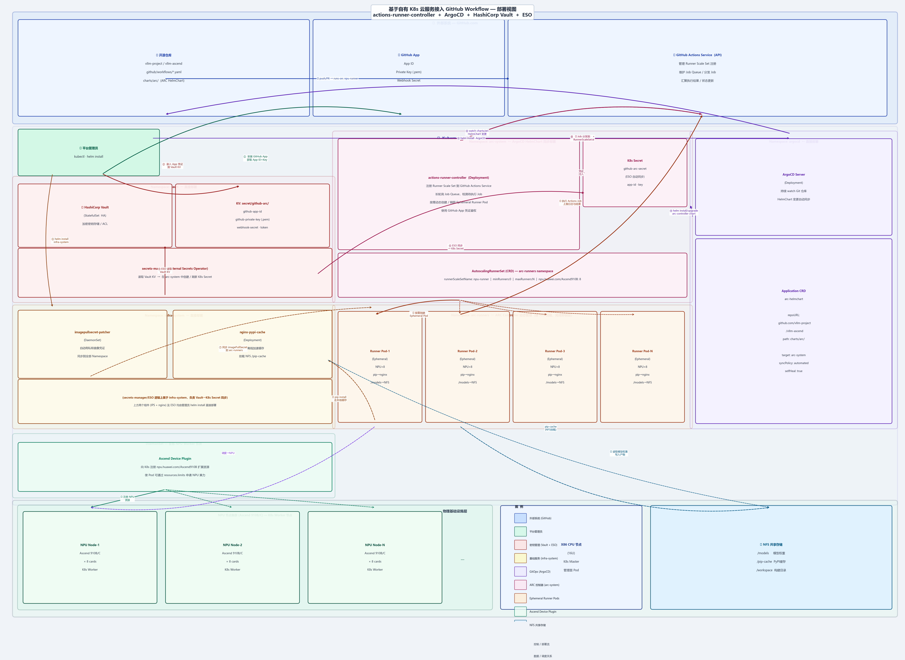

# CI 基础设施部署架构说明

> 本文档面向参与开源，介绍项目 CI 流水线背后的自托管基础设施架构。
> 如需参与 CI 相关的维护或改造工作，请先阅读本文档以了解整体结构。

---

## 架构总览



上图展示了完整的部署架构，分为三个纵向职责域：

| 域 | 内容 | 职责 |
|---|---|---|
| **左栏** | Vault + infra-system + Device Plugin | 密钥管理 / 基础服务 / NPU 资源注册 |
| **中栏** | arc-system + arc-runners | ARC 控制器 + 动态 Runner Pod 执行面 |
| **右栏** | ArgoCD | GitOps 管控，负责 ARC HelmChart 同步 |

---

## 一、物理基础设施层

```
┌─────────────────────────────────────────────────────────────────┐
│  NPU 节点集群 (Ascend 910B/C × N)   │  X86 CPU 节点  │  NFS     │
└─────────────────────────────────────────────────────────────────┘
```

| 组件 | 规格 | 说明 |
|---|---|---|
| **NPU 节点** | Ascend 910B/C，每节点 8 卡 | K8s 节点，用于承载 Runner Pod |
| **X86 CPU 节点** | 16 核 | K8s 节点，同时运行管理面 Pod（Vault、ArgoCD 等） |
| **NFS 共享存储** | - | 挂载到全部节点，提供模型权重、PyPI 缓存、构建目录 |

NFS 目录约定示例：

```
/models       ← 模型权重（Runner 推理测试时读取）
/pip-cache    ← PyPI 本地缓存（nginx-pypi-cache 挂载）
/workspace    ← 构建临时目录
```

---

## 二、Kubernetes 集群

在上述物理节点上部署标准 K8s 集群：

- X86 CPU 节点，运行仅能支持X86的服务
- 全部 NPU 节点，用于调度 Runner Pod

### 2.1 Ascend Device Plugin（DaemonSet）

Device Plugin 以 DaemonSet 形式部署在全部 NPU Worker 节点，负责向 K8s 注册 NPU 扩展资源：

Runner Pod 通过该资源声明获得 NPU 算力分配。

---

## 三、基础服务（管理员直接部署）

以下服务由**平台管理员通过 `helm install` 直接部署**，不经由 ArgoCD 管理：

### 3.1 HashiCorp Vault（`namespace: vault`）

**职责**：加密存储所有敏感凭证，提供细粒度访问控制。

关键 KV 路径：

```
secret/github-arc/
├── github-app-id         # GitHub App 的数字 ID
├── github-private-key    # GitHub App 私钥（.pem 格式）
├── webhook-secret        # Webhook 签名密钥
└── runner-token          # 其他仓库级别密钥
```

> **注意**：Vault Unseal Key 由平台管理员持有，不存储在任何版本控制系统中。

### 3.2 secrets-manager / ESO（`namespace: infra-system`）

**职责**：[External Secrets Operator](https://external-secrets.io/)，周期性读取 Vault KV，自动在 `arc-system` namespace 中创建或刷新 K8s Secret。

```
Vault KV  ──(ESO 读取)──►  K8s Secret: github-arc-secret
                                   │
                                   └──► 注入到 ARC Controller Pod
```

### 3.3 imagepullsecret-patcher（`namespace: infra-system`）

**职责**：DaemonSet，监听 Namespace 创建事件，将私有镜像仓库的 `imagePullSecret` 自动同步到全部 Namespace（包括动态创建的 `arc-runners`），确保 Runner Pod 可正常拉取私有镜像。

### 3.4 nginx-pypi-cache（`namespace: infra-system`）

**职责**：PyPI 私有加速缓存服务，挂载 NFS `/pip-cache` 目录。

Runner Pod 通过环境变量使用本地缓存，避免每次 `pip install` 访问公网：

```bash
PIP_INDEX_URL=http://nginx-pypi-cache.infra-system.svc/simple
PIP_TRUSTED_HOST=nginx-pypi-cache.infra-system.svc
```

### 3.5 ArgoCD（`namespace: argocd`）

**职责**：GitOps 引擎，**仅用于管理 actions-runner-controller 的部署**（其自身由管理员直接部署）。

ArgoCD 持续监听 Git 仓库中 `charts/arc/` 目录的 HelmChart 变更，自动同步部署到 K8s。

---

## 四、actions-runner-controller（ArgoCD 同步部署）

ARC 是唯一通过 ArgoCD 管理的组件，实现 GitOps 受控升级。

### 4.1 架构组成

```
namespace: arc-system
├── actions-runner-controller (Deployment)   ← 控制器
├── K8s Secret: github-arc-secret            ← 由 ESO 从 Vault 同步
└── AutoscalingRunnerSet (CRD)               ← Runner 规格定义

namespace: arc-runners
└── Runner Pod-1 / Pod-2 / ... / Pod-N       ← Ephemeral，按需创建
```

### 4.2 工作模式（Scale Sets）

ARC 采用 **Scale Sets 模式**（v0.5+ 推荐），工作流程如下：

```
开发者 push/PR
    │
    ▼  ⑪ 触发 workflow（runs-on: npu-runner）
GitHub Actions Service（Job Queue）
    │
    ▼  ⑫ Job 分发给匹配的 Runner Scale Set
ARC Controller（arc-system）
    │  ⑬ 检测到 Job，按 AutoscalingRunnerSet 规格
    ▼     动态创建 Ephemeral Runner Pod
Runner Pod（arc-runners）
    │  ⑭ 注册为 Runner → 拉取 Job → 执行 Steps → 上报结果
    ▼
Job 完成 → Runner Pod 自动销毁
```

---

## 五、GitHub App 集成
集成方案[user-manual-zh.md](user-manual-zh.md)

---

## 六、完整部署时序

以下为从零开始的推荐部署顺序：

```
阶段 1：物理层 & K8s
  1. 准备 NPU 节点 + X86 节点 + NFS 存储
  2. 搭建 K8s 集群（X86，NPU 节点）
  3. 部署 Ascend Device Plugin（DaemonSet）

阶段 2：基础服务（直接 helm install，顺序无强依赖）
  4. helm install vault           # 先于 ESO，否则 ESO 无 Backend
  5. helm install argocd          # 先于 ARC，否则无法同步
  6. helm install external-secrets  # secrets-manager / ESO
  7. helm install imagepullsecret-patcher
  8. helm install nginx-pypi-cache  # 需要 NFS PVC 就绪

阶段 3：凭证配置
  9.  在开源仓安装 GitHub App，获取 App ID + Private Key
  10. 将凭证录入 Vault KV（vault kv put secret/github-arc/ ...）
  11. ESO ExternalSecret CR 创建后，自动同步 K8s Secret

阶段 4：ArgoCD 同步 ARC
  12. 在 ArgoCD 中创建 Application（指向 charts/arc/）
  13. ArgoCD 自动同步，部署 ARC Controller 到 arc-system
  14. ARC 读取 K8s Secret，完成向 GitHub Actions Service 注册

阶段 5：仓库配置
  15. 在 .github/workflows/*.yaml 中使用 Runner：
      runs-on: [self-hosted, npu-runner]
```

---

## 七、贡献者须知

### 7.1 如何触发 NPU CI

在 PR 的 workflow 文件中指定 Runner 标签：

```yaml
jobs:
  npu-test:
    runs-on: [self-hosted, npu-runner]
    steps:
      - uses: actions/checkout@v4
      - name: Run NPU tests
        run: pytest tests/e2e/ -v
```

### 7.2 Runner Pod 的环境约定

每个 Runner Pod 启动时具备以下环境：

| 资源 / 环境 | 值 | 说明 |
|---|---|---|
| NPU 卡数 | 8 × Ascend 910B/C | 通过 Device Plugin 分配 |
| `/models` | NFS 挂载 | 预置模型权重，无需每次下载 |
| `PIP_INDEX_URL` | nginx-pypi-cache | pip 走本地缓存，加速依赖安装 |
| Runner 生命周期 | Ephemeral | Job 完成后 Pod 自动销毁，环境完全隔离 |

### 7.3 安全边界

- **Vault 凭证不暴露**：所有敏感凭证存储在 Vault，通过 ESO 注入，不出现在 Git 仓库或 Pod 环境变量明文中
- **Runner 隔离**：每个 Job 使用独立的 Ephemeral Pod，Job 间无状态共享
- **镜像来源受控**：imagepullsecret-patcher 确保只有授权的私有镜像仓库凭证被使用
- **GitOps 变更可审计**：ARC 版本变更通过 Git PR → ArgoCD 同步，全程留有审计记录

### 7.4 常见问题

**Q：Runner 长时间 Pending，Job 未执行？**

可能原因：
1. ARC Controller 未成功向 GitHub Actions Service 注册（检查 K8s Secret 是否同步）
2. NPU 节点资源不足（检查 `kubectl describe node`）
3. imagepullsecret-patcher 未同步，导致 Runner Pod 镜像拉取失败

**Q：pip install 速度很慢？**

检查 `PIP_INDEX_URL` 环境变量是否指向 `nginx-pypi-cache` 服务，以及 NFS `/pip-cache` 是否正常挂载。

---
