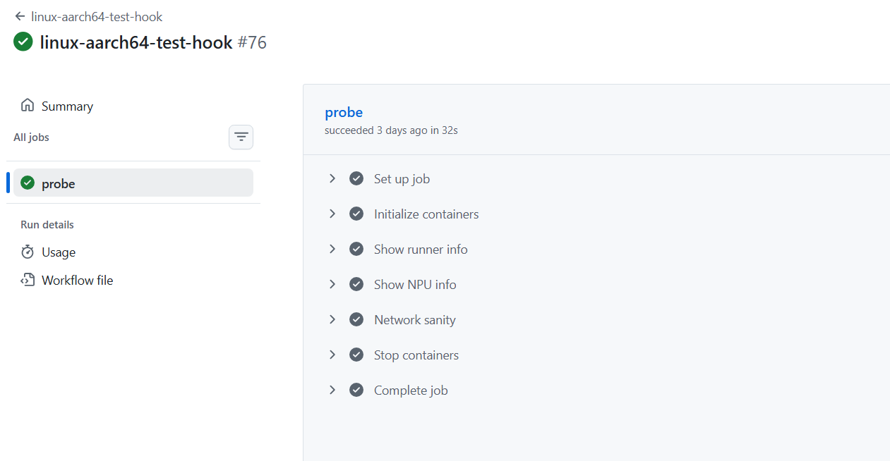
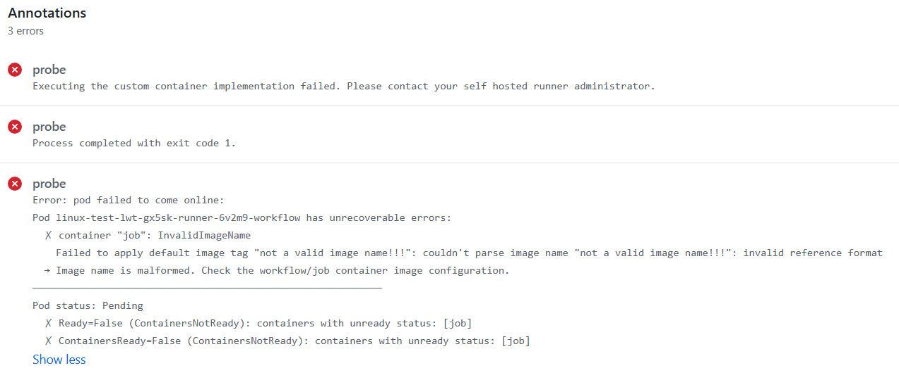
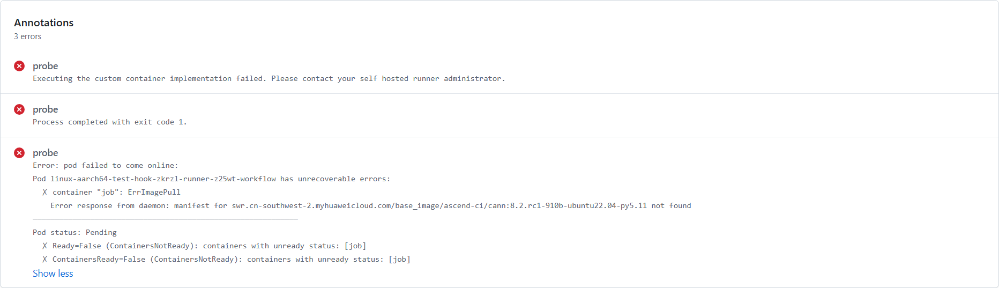
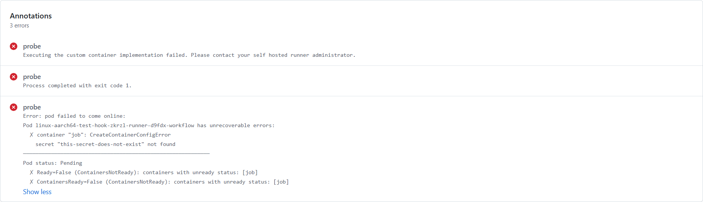
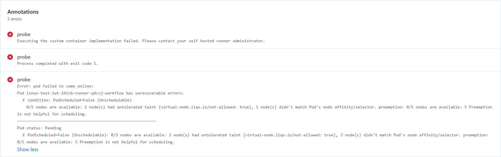
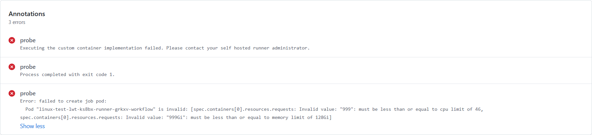
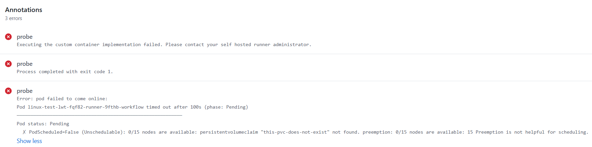
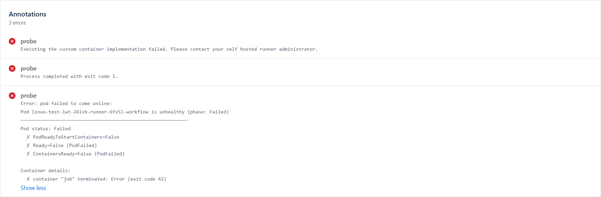
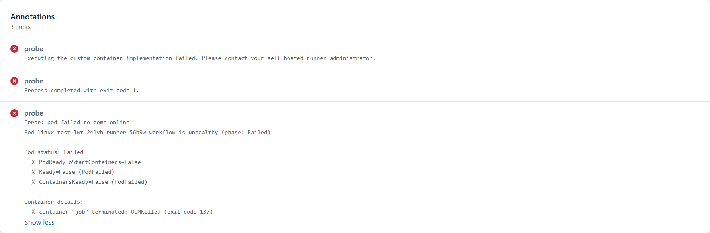
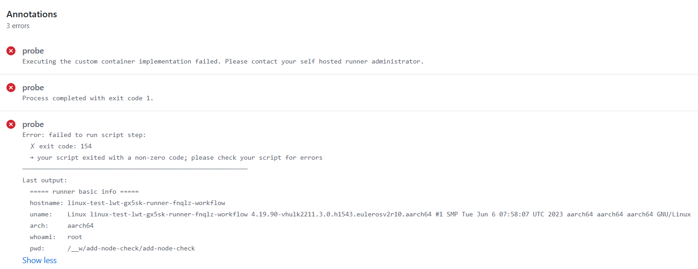

# Pod Status Reference

This page catalogs known pod statuses observed across the runner pod lifecycle, with verified GitHub Actions run examples for each case. Use it for troubleshooting or to understand expected behavior.

Expected pod state transitions for a successful run: **Pending → Running → Succeeded** (terminal — pod is then removed)

<!-- ERROR_SUMMARY_TABLE_START -->
| Phase | Category | Error |
| :--- | :--- | :--- |
| — | — | [Normal Flow](#normal-flow) |
| Pending | Image | [InvalidImageName](#invalidimagename) |
| Pending | Image | [ErrImagePull](#errimagepull) |
| Pending | Container Creation | [CreateContainerConfigError](#createcontainerconfigerror) |
| Pending | Scheduling | [FailedScheduling (nodeSelector)](#failedscheduling-nodeselector) |
| Pending | Scheduling | [FailedScheduling (resource limit)](#failedscheduling-resource-limit) |
| Pending | Scheduling | [FailedBinding](#failedbinding) |
| Running | Container Runtime | [Container crash](#container-crash) |
| Running | Container Runtime | [OOMKilled](#oomkilled) |
| Running | Workflow | [UserScriptError](#userscripterror) |
<!-- ERROR_SUMMARY_TABLE_END -->

---

## Normal Flow

Manually trigger the correct workflow with a valid, pullable image. Pod transitions: Pending → Running → Succeeded.

> **Ref:**
> [linux-aarch64-test-hook · ascend-gha-runners/add-node-check@22e524c](https://github.com/ascend-gha-runners/add-node-check/actions/runs/28346510462)

---

## Pending Phase

### Image Errors

#### InvalidImageName

Invalid image name format.

> **Ref:**
> [linux-aarch64-test-hook_invalid-image-name · ascend-gha-runners/add-node-check@22e524c](https://github.com/ascend-gha-runners/add-node-check/actions/runs/29319721644)

#### ErrImagePull

Image does not exist.

> **Ref:**
> [linux-aarch64-test-hook_err-image-pull · ascend-gha-runners/add-node-check@22e524c](https://github.com/ascend-gha-runners/add-node-check/actions/runs/29319718531)

### Container Creation Errors

#### CreateContainerConfigError

Referencing a non-existent Secret.

> **Ref:**
> [linux-aarch64-test-hook · ascend-gha-runners/add-node-check@22e524c](https://github.com/ascend-gha-runners/add-node-check/actions/runs/28346768522)

### Scheduling Errors

#### FailedScheduling (nodeSelector)

`nodeSelector` mismatch — no node satisfies the label constraints.

> **Ref:**
> [linux-aarch64-test-hook · ascend-gha-runners/add-node-check@b4b3d9d](https://github.com/ascend-gha-runners/add-node-check/actions/runs/29317874137)

#### FailedScheduling (resource limit)

Resource request exceeds node limit (422 scenario).

> **Ref:**
> [linux-aarch64-test-hook · ascend-gha-runners/add-node-check@b4b3d9d](https://github.com/ascend-gha-runners/add-node-check/actions/runs/29317502668)

#### FailedBinding

PVC does not exist.

> **Ref:**
> [linux-aarch64-test-hook · ascend-gha-runners/add-node-check@b4b3d9d](https://github.com/ascend-gha-runners/add-node-check/actions/runs/29318217127)

---

## Running Phase

### Container Runtime Errors

#### Container crash

Exit non-zero — container exits immediately after start.

> **Ref:**
> [linux-aarch64-test-hook · ascend-gha-runners/add-node-check@b4b3d9d](https://github.com/ascend-gha-runners/add-node-check/actions/runs/28562662088)

#### OOMKilled

Out of memory — container killed by the kernel OOM killer.

> **Ref:**
> [linux-aarch64-test-hook · ascend-gha-runners/add-node-check@b4b3d9d](https://github.com/ascend-gha-runners/add-node-check/actions/runs/28570845291)

### Workflow Errors

#### UserScriptError

User script step exited with non-zero code. K8s pod reason: `Error`. Unlike container crash, the runner container started successfully and workflow steps executed — the failure is in the script logic itself.

> **Ref:**
> [linux-aarch64-test-hook_user-script-error · ascend-gha-runners/add-node-check@3cd45c8](https://github.com/ascend-gha-runners/add-node-check/actions/runs/29319724802)

---

## Support

If you encounter an issue not listed on this page, please [create a discussion](https://github.com/ascend-gha-runners/docs/discussions) or contact the infrastructure team.

---

**Document version:** v2.0
**Last updated:** 2026-07-14
