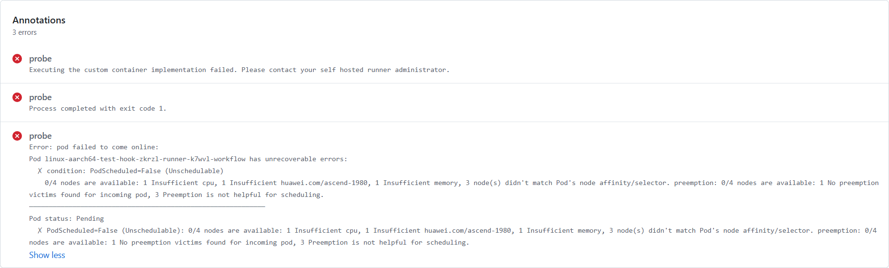

# Error Types Reference

Expected pod state transitions for a successful run: **Pending → Running → Succeeded**

<!-- ERROR_SUMMARY_TABLE_START -->
| Phase | Category | Error | Verified |
| :--- | :--- | :--- | :---: |
| — | — | [Normal Flow](#normal-flow) | ✅ |
| Pending | Image | [InvalidImageName](#invalidimagename) | ✅ |
| Pending | Image | [ErrImagePull](#errimagepull) | ✅ |
| Pending | Container Creation | [CreateContainerConfigError](#createcontainerconfigerror) | ✅ |
| Pending | Container Creation | [CreateContainerError](#createcontainererror) | ✅ |
| Pending | Scheduling | [FailedScheduling — nodeSelector mismatch](#failedscheduling-nodeselector) | ✅ |
| Pending | Scheduling | [FailedBinding — PVC not found](#failedbinding) | ✅ |
| Pending | Scheduling | [FailedScheduling — resource limit (422)](#failedscheduling-resource-limit) | ✅ |
| Running | Container Runtime | [Container crash — exit non-zero](#container-crash) | ✅ |
| Running | Container Runtime | [OOMKilled](#oomkilled) | ✅ |
| Running | Container Runtime | [FailedPostStartHook](#failedpoststarkhook) | ✅ |
<!-- ERROR_SUMMARY_TABLE_END -->

---

## Normal Flow

Manually trigger the correct workflow with a valid, pullable image. Pod transitions: Pending → Running → Succeeded.

> **e.g.**
> [linux-aarch64-test-hook · ascend-gha-runners/add-node-check@22e524c](https://github.com/ascend-gha-runners/add-node-check/actions/runs/28346510462)

---

## Pending Phase

### Image Errors

#### InvalidImageName

Invalid image name format.

> **e.g.**
> [linux-aarch64-test-hook_invalid-image-name · ascend-gha-runners/add-node-check@22e524c](https://github.com/ascend-gha-runners/add-node-check/actions/runs/28346604103)

---

#### ErrImagePull

Image does not exist.

> **e.g.**
> [linux-aarch64-test-hook_err-image-pull · ascend-gha-runners/add-node-check@22e524c](https://github.com/ascend-gha-runners/add-node-check/actions/runs/28346673285)

---

### Container Creation Errors

#### CreateContainerConfigError

Referencing a non-existent Secret.

> **e.g.**
> [linux-aarch64-test-hook · ascend-gha-runners/add-node-check@22e524c](https://github.com/ascend-gha-runners/add-node-check/actions/runs/28346768522)

---

#### CreateContainerError

Invalid `securityContext`.

> **e.g.**
> [linux-aarch64-test-hook · ascend-gha-runners/add-node-check@22e524c](https://github.com/ascend-gha-runners/add-node-check/actions/runs/28346853546)

---

### Scheduling Errors

#### FailedScheduling (nodeSelector)

`nodeSelector` mismatch — no node satisfies the label constraints.

> **e.g.**
> [linux-aarch64-test-hook · ascend-gha-runners/add-node-check@b4b3d9d](https://github.com/ascend-gha-runners/add-node-check/actions/runs/28562227896)

---

#### FailedBinding

PVC does not exist.

> **e.g.**
> [linux-aarch64-test-hook · ascend-gha-runners/add-node-check@b4b3d9d](https://github.com/ascend-gha-runners/add-node-check/actions/runs/28562333058)

---

#### FailedScheduling (resource limit)

Resource request exceeds node limit (422 scenario).

> **e.g.**
> [linux-aarch64-test-hook · ascend-gha-runners/add-node-check@b4b3d9d](https://github.com/ascend-gha-runners/add-node-check/actions/runs/28571626882)

---

## Running Phase

### Container Runtime Errors

#### Container crash

Exit non-zero — container exits immediately after start.

> **e.g.**
> [linux-aarch64-test-hook · ascend-gha-runners/add-node-check@b4b3d9d](https://github.com/ascend-gha-runners/add-node-check/actions/runs/28562662088)

---

#### OOMKilled

Out of memory — container killed by the kernel OOM killer.

> **e.g.**
> [linux-aarch64-test-hook · ascend-gha-runners/add-node-check@b4b3d9d](https://github.com/ascend-gha-runners/add-node-check/actions/runs/28570845291)

---

#### FailedPostStartHook

`postStart` hook failed.

> **e.g.**
> [linux-aarch64-test-hook · ascend-gha-runners/add-node-check@b4b3d9d](https://github.com/ascend-gha-runners/add-node-check/actions/runs/28562900088)
