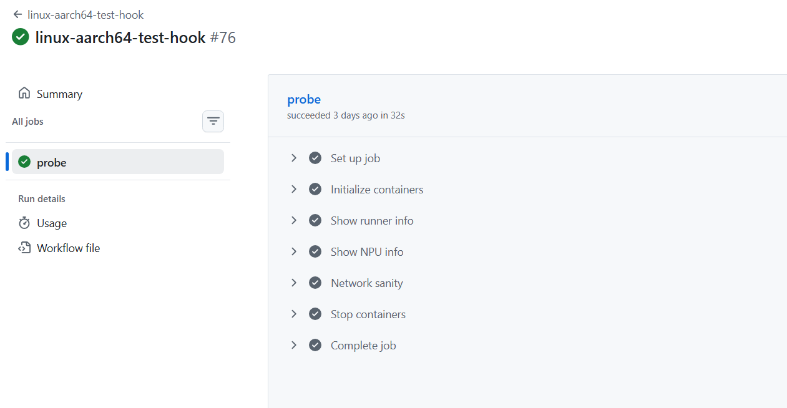
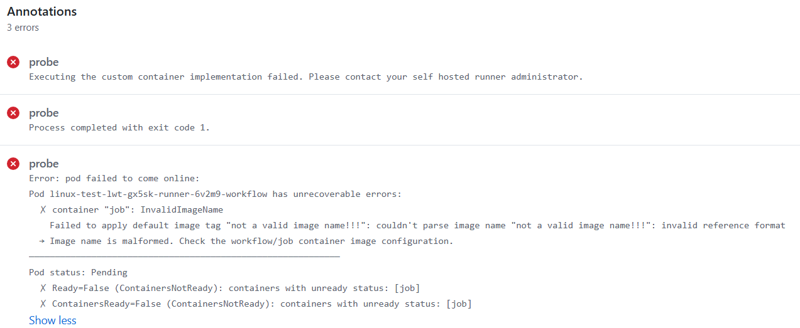
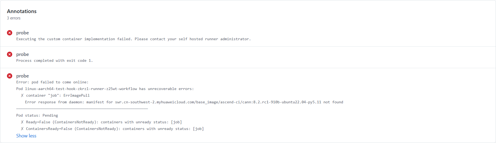
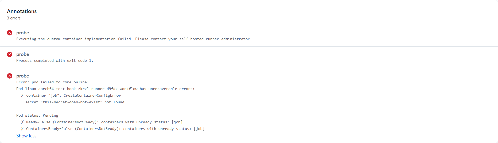
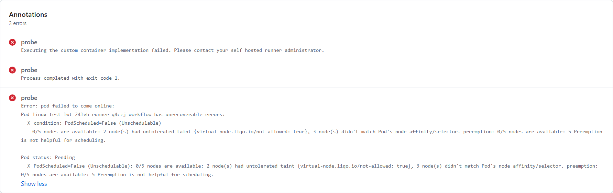
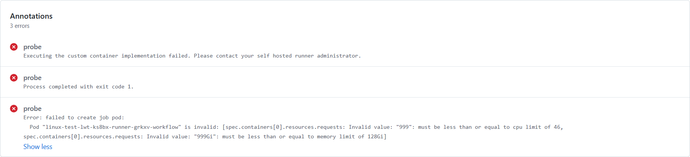
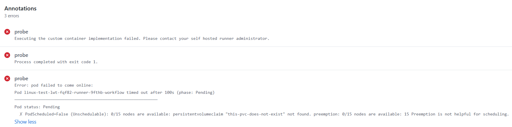
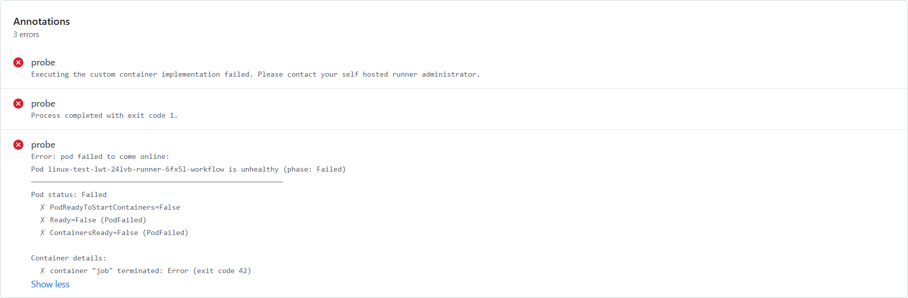
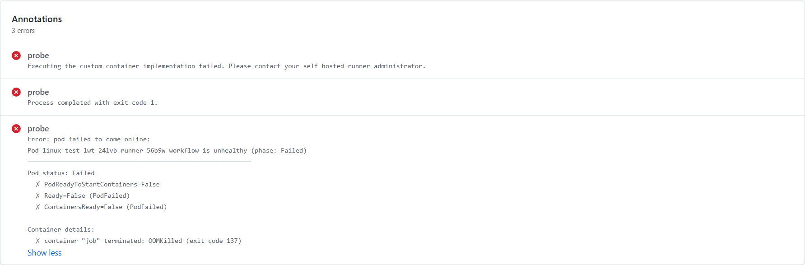
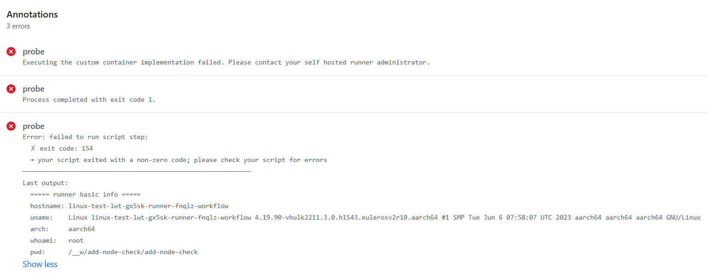

# Job Failure Reference

This page catalogs known job failure scenarios observed across the runner pod lifecycle, with verified GitHub Actions run examples for each case. Use it for troubleshooting or to understand expected behavior.

Expected pod state transitions for a successful run: **Pending → Running → Succeeded** (terminal — pod is then removed)

<!-- ERROR_SUMMARY_TABLE_START -->
| Phase | Category | Error |
| :--- | :--- | :--- |
| — | — | [Normal Flow](#normal-flow) |
| Pending | Image | [InvalidImageName](#invalidimagename) |
| Pending | Image | [ErrImagePull](#errimagepull) |
| Pending | Image | [ErrImagePull: 401 after registry change](#errimagepull-401-unauthorized-after-registry-change) |
| Pending | Image | [Image not synced to SWR (not found)](#image-not-synced-to-swr) |
| Pending | Container Creation | [CreateContainerConfigError](#createcontainerconfigerror) |
| Pending | Scheduling | [FailedScheduling (nodeSelector)](#failedscheduling-nodeselector) |
| Pending | Scheduling | [FailedScheduling (resource limit)](#failedscheduling-resource-limit) |
| Pending | Scheduling | [FailedBinding](#failedbinding) |
| Pending | Virtual Node Offloading | [Liqo namespace not offloaded (task stuck)](#liqo-offloading-backoff) |
| Running | Container Runtime | [Container crash](#container-crash) |
| Running | Container Runtime | [OOMKilled](#oomkilled) |
| Running | Workflow | [UserScriptError](#userscripterror) |
| Running | Workflow | [Artifact / log upload failed (whitelist)](#upload-artifact-whitelist) |
| Running | Task Hang | [Task hang / timeout (engine process stuck)](#vllm-v1-streaming-hang) |
| Running | Communication | [HCCL Port Already Bound](#hccl-port-already-bound) |
| Running | Environment | [Model Cache Missing / Incomplete](#incomplete-model-snapshot) |
<!-- ERROR_SUMMARY_TABLE_END -->

---

## Normal Flow

Manually trigger the correct workflow with a valid, pullable image. Pod transitions: Pending → Running → Succeeded.

> **Ref:**
> [linux-aarch64-test-hook · ascend-gha-runners/add-node-check@22e524c](https://github.com/ascend-gha-runners/add-node-check/actions/runs/28346510462)

---

## Pending Phase

### Image Errors

#### InvalidImageName

Invalid image name format.

> **Ref:**
> [linux-aarch64-test-hook_invalid-image-name · ascend-gha-runners/add-node-check@22e524c](https://github.com/ascend-gha-runners/add-node-check/actions/runs/29319721644)

#### ErrImagePull

Image does not exist.

> **Ref:**
> [linux-aarch64-test-hook_err-image-pull · ascend-gha-runners/add-node-check@22e524c](https://github.com/ascend-gha-runners/add-node-check/actions/runs/29319718531)

#### ErrImagePull: 401 Unauthorized After Registry Change

Image pulls fail with `401 Unauthorized` after the registry address was changed (e.g., swr.cn-sourthwest → swr.cn-north-12) — the runner's existing secret has no pull permission for the new registry. Before switching registries, confirm with the infrastructure team whether the new registry is public or credentials exist, or make the image public.

> **Ref:**
> [#250](https://github.com/ascend-gha-runners/docs/issues/250)

#### Image not synced to SWR (not found) { #image-not-synced-to-swr }

Build / image pull fails with `failed to resolve source metadata ... not found` (issue #223). After the upstream image source changed (e.g., `quay.io/ascend` → `quay.io/atlas-ci`), the SWR redirect repository address was not updated. Check the source→SWR mapping in sync-tools `image-sync.json`, update the SWR redirect address accordingly, then re-run.

> **Ref:**
> [#223](https://github.com/ascend-gha-runners/docs/issues/223)

### Container Creation Errors

#### CreateContainerConfigError

Referencing a non-existent Secret.

> **Ref:**
> [linux-aarch64-test-hook · ascend-gha-runners/add-node-check@22e524c](https://github.com/ascend-gha-runners/add-node-check/actions/runs/28346768522)

### Scheduling Errors

#### FailedScheduling (nodeSelector)

`nodeSelector` mismatch — no node satisfies the label constraints.

> **Ref:**
> [linux-aarch64-test-hook · ascend-gha-runners/add-node-check@b4b3d9d](https://github.com/ascend-gha-runners/add-node-check/actions/runs/29317874137)

#### FailedScheduling (resource limit)

Resource request exceeds node limit (422 scenario).

> **Ref:**
> [linux-aarch64-test-hook · ascend-gha-runners/add-node-check@b4b3d9d](https://github.com/ascend-gha-runners/add-node-check/actions/runs/29317502668)

#### FailedBinding

PVC does not exist.

> **Ref:**
> [linux-aarch64-test-hook · ascend-gha-runners/add-node-check@b4b3d9d](https://github.com/ascend-gha-runners/add-node-check/actions/runs/29318217127)

### Virtual Node Offloading Errors

#### Liqo namespace not offloaded (task stuck) { #liqo-offloading-backoff }

Task stays **Waiting**, the runner pod is in **`OffloadingBackOff`** and never starts on the target remote cluster; NamespaceOffloading stays in **`CreationLoopBackOff`** (issue #205). A pre-existing namespace on the remote cluster lacks the Liqo takeover markers, so Liqo refuses to reflect pods (`ReflectionDisabled`). Add the same markers used by other clusters (`label liqo.io/remote-cluster-id`, annotations `liqo.io/managed-by-namespace-map` / `liqo.io/original-name`) — non-destructive, no changes to PVC/SA/namespace content — then it recovers; pin the markers into the deployment repo kustomization to avoid drift.

> **Ref:**
> [#205](https://github.com/ascend-gha-runners/docs/issues/205)

---

## Running Phase

### Container Runtime Errors

#### Container crash

Exit non-zero — container exits immediately after start.

> **Ref:**
> [linux-aarch64-test-hook · ascend-gha-runners/add-node-check@b4b3d9d](https://github.com/ascend-gha-runners/add-node-check/actions/runs/28562662088)

#### OOMKilled

Out of memory — container killed by the kernel OOM killer.

> **Ref:**
> [linux-aarch64-test-hook · ascend-gha-runners/add-node-check@b4b3d9d](https://github.com/ascend-gha-runners/add-node-check/actions/runs/28570845291)

### Workflow Errors

#### UserScriptError

User script step exited with non-zero code. K8s pod reason: `Error`. Unlike container crash, the runner container started successfully and workflow steps executed — the failure is in the script logic itself.

> **Ref:**
> [linux-aarch64-test-hook_user-script-error · ascend-gha-runners/add-node-check@3cd45c8](https://github.com/ascend-gha-runners/add-node-check/actions/runs/29319724802)

#### Artifact / log upload failed (whitelist) { #upload-artifact-whitelist }

Artifact / log upload reports `Upload progress stalled`, then the container hook fails (`Executing the custom container implementation failed`, exit code 1) (issue #197). The upload target URL was not added to the network whitelist. Ask the infrastructure team to whitelist the target domain (one-off, persists afterwards), then re-run.

> **Ref:**
> [#197](https://github.com/ascend-gha-runners/docs/issues/197)

### Task Hang / Timeout

#### Task hang / timeout (engine process stuck) { #vllm-v1-streaming-hang }

Task runs for hours with no output and is cancelled on timeout; the pod shows **Running** but logs stop updating (issue #216: cancelled after a 4h5m timeout). The vLLM v1 engine core crashed / deadlocked mid streaming inference (16-card worker with speculative decoding + DP×TP + expert parallel), so the output queue gets neither tokens nor a proper finish and the client blocks forever on `await q.get()`. The Running pod only means the runner container is alive — it is a **business-code / test-case issue**. Check whether the log stack ends at `async_llm.py` `q.get()` or `output_processor.py` `raise output`; reproduce with the launch params; if you don't need to keep waiting, cancel from the GitHub Actions page and re-run.

> **Ref:**
> [#216](https://github.com/ascend-gha-runners/docs/issues/216)

### Communication Errors

#### HCCL Port Already Bound

Multi-node job fails in Running phase with `Communication_Error_Bind_IP_Port(EI0019): ... The IP address ... and port 60000 have already been bound.` — the port is occupied by another process or the service process was started multiple times on one device. Check port occupancy; adjust via `HCCL_IF_BASE_PORT` or `sysctl -w net.ipv4.ip_local_reserved_ports`; fix the test case and re-run.

> **Ref:**
> [#219](https://github.com/ascend-gha-runners/docs/issues/219)

### Environment Errors

#### Model Cache Missing / Incomplete { #incomplete-model-snapshot }

Running phase fails with model-cache errors in two forms: **incomplete** — `huggingface_hub.errors.IncompleteSnapshotError: The cached snapshot ... is incomplete: N file(s) are missing` (issue #242); or **missing** — `huggingface_hub.errors.LocalEntryNotFoundError: Cannot find an appropriate cached snapshot folder ... outgoing traffic has been disabled` (issue #220), or a missing shard (issue #200). The cluster the task actually landed on has no such model cache or an incomplete one, and `local_files_only=True` prevents online completion. Identify the missing model/files, verify the cache on that cluster, ask the infrastructure team to complete / re-download it, then re-trigger the workflow.

> **Ref:**
> [#242](https://github.com/ascend-gha-runners/docs/issues/242)
> [#220](https://github.com/ascend-gha-runners/docs/issues/220)
> [#200](https://github.com/ascend-gha-runners/docs/issues/200)

---

## Support

If you encounter an issue not listed on this page, please [create a discussion](https://github.com/ascend-gha-runners/docs/discussions) or contact the infrastructure team.

---

**Document version:** v2.2
**Last updated:** 2026-09-24
