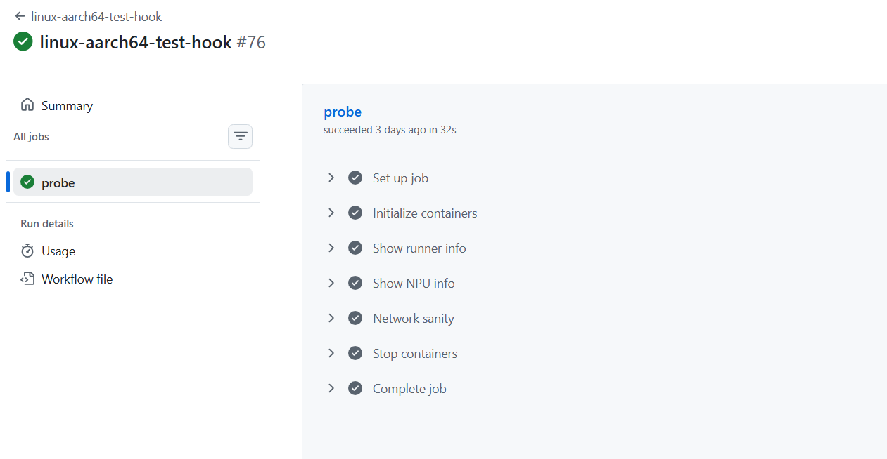
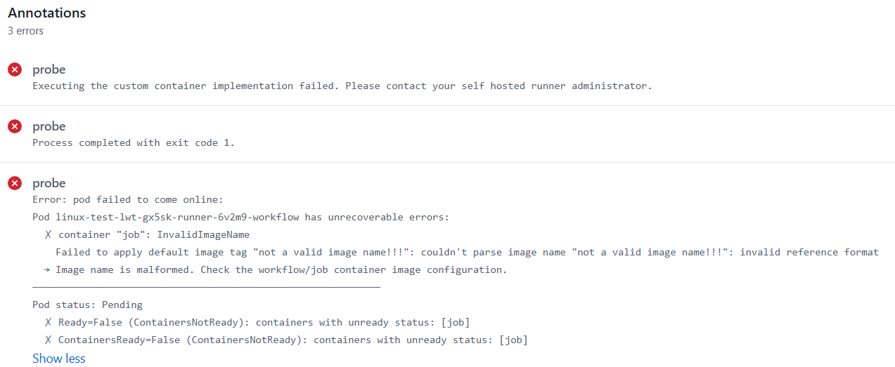
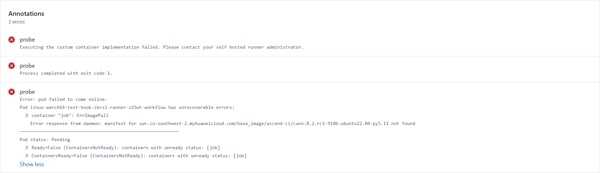
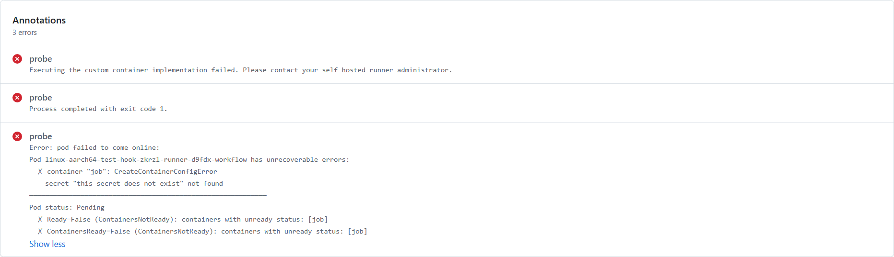
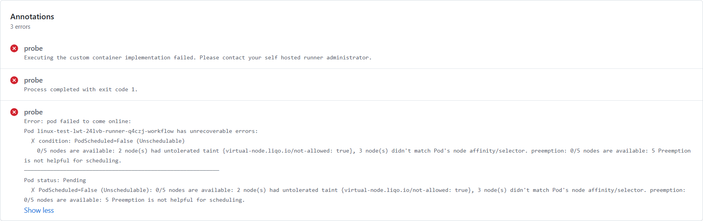
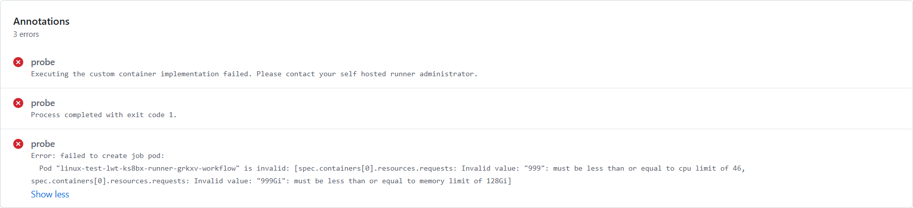
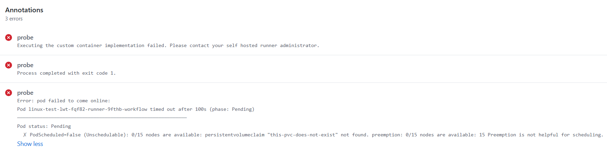
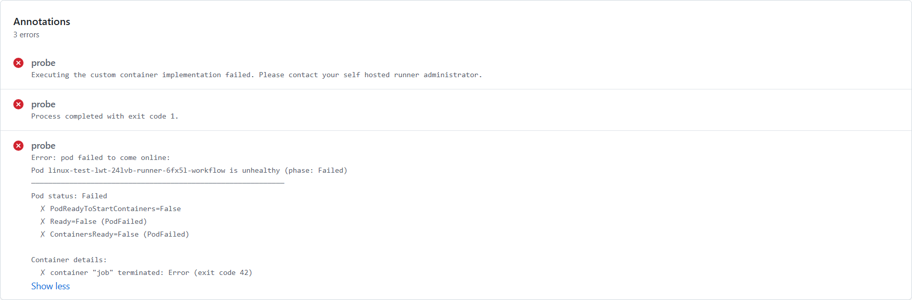
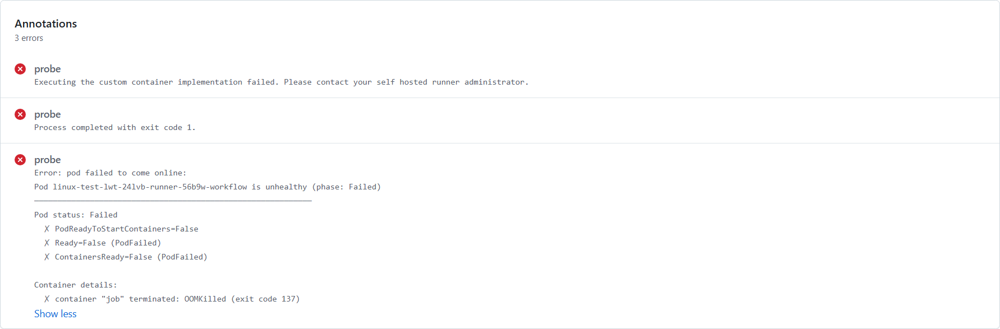
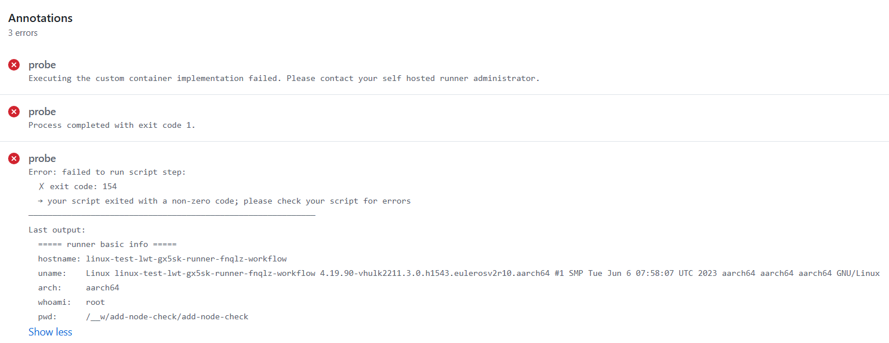

# Job Failure Reference

This page catalogs known job failure scenarios observed across the runner pod lifecycle, with verified GitHub Actions run examples for each case. Use it for troubleshooting or to understand expected behavior.

Expected pod state transitions for a successful run: **Pending → Running → Succeeded** (terminal — pod is then removed)

<!-- ERROR_SUMMARY_TABLE_START -->
| Phase | Category | Error |
| :--- | :--- | :--- |
| — | — | [Normal Flow](#normal-flow) |
| Pending | Image | [InvalidImageName](#invalidimagename) |
| Pending | Image | [ErrImagePull](#errimagepull) |
| Pending | Image | [ErrImagePull: 401 after registry change](#errimagepull-401-unauthorized-after-registry-change) |
| Pending | Image | [Image not synced to SWR (not found)](#image-not-synced-to-swr) |
| Pending | Image | [Image pull slow (Initialize containers stuck)](#image-pull-slow) |
| Pending | Container Creation | [CreateContainerConfigError](#createcontainerconfigerror) |
| Pending | Container Creation | [Container dies immediately (postStart hook exit 137)](#poststart-exit-137) |
| Pending | Container Creation | [novolume mode failures / extra time](#novolume-hook-failures) |
| Pending | Scheduling | [FailedScheduling (nodeSelector)](#failedscheduling-nodeselector) |
| Pending | Scheduling | [FailedScheduling (resource limit)](#failedscheduling-resource-limit) |
| Pending | Scheduling | [FailedBinding](#failedbinding) |
| Pending | Scheduling | [Scheduled onto an arch-mismatched node](#arch-mismatch) |
| Pending | Virtual Node Offloading | [Liqo namespace not offloaded (task stuck)](#liqo-offloading-backoff) |
| Running | Container Runtime | [Container crash](#container-crash) |
| Running | Container Runtime | [OOMKilled](#oomkilled) |
| Running | Container Runtime | [/dev/shm exhausted](#dev-shm-oom) |
| Running | Workflow | [UserScriptError](#userscripterror) |
| Running | Workflow | [Artifact / log upload failed (whitelist)](#upload-artifact-whitelist) |
| Running | Workflow | [Install / build OOM (parallelism too high)](#compile-oom-threads) |
| Running | Workflow | [Dependency cache errors (pypi / rust)](#dependency-cache-error) |
| Running | Workflow | [Abnormally slow steps (model load / checkout)](#ci-slow) |
| Running | Task Hang | [Task hang / timeout (engine process stuck)](#vllm-v1-streaming-hang) |
| Running | Communication | [HCCL Port Already Bound](#hccl-port-already-bound) |
| Running | Environment | [Model Cache Missing / Incomplete](#incomplete-model-snapshot) |
| Platform | Node Resource | [Node NPU occupied by an out-of-band process / container](#npu-occupied-by-external) |
| Platform | Storage | [Shared disk full / stale lock file](#shared-storage-lock-and-space) |
| Platform | Node | [Node DNS failure / clock skew](#node-infra-abnormal) |
| Platform | Node | [Node hardware failure (NPU hang / NotReady)](#node-hardware-failure) |
| Platform | Autoscaling | [Scale-out failure / unhealthy elastic node](#elastic-scale-out-failed) |
| Platform | Runner | [Runner slots held by stuck EphemeralRunners](#ephemeralrunner-stuck) |
| Platform | Runner | [Runner version too old (GitHub minimum bumped)](#runner-version-eol) |
<!-- ERROR_SUMMARY_TABLE_END -->

---

## Normal Flow

Manually trigger the correct workflow with a valid, pullable image. Pod transitions: Pending → Running → Succeeded.

> **Ref:**
> [linux-aarch64-test-hook · ascend-gha-runners/add-node-check@22e524c](https://github.com/ascend-gha-runners/add-node-check/actions/runs/28346510462)

---

## Pending Phase

### Image Errors

#### InvalidImageName

Invalid image name format.

> **Ref:**
> [linux-aarch64-test-hook_invalid-image-name · ascend-gha-runners/add-node-check@22e524c](https://github.com/ascend-gha-runners/add-node-check/actions/runs/29319721644)

#### ErrImagePull

Image does not exist.

> **Ref:**
> [linux-aarch64-test-hook_err-image-pull · ascend-gha-runners/add-node-check@22e524c](https://github.com/ascend-gha-runners/add-node-check/actions/runs/29319718531)

#### ErrImagePull: 401 Unauthorized After Registry Change

Image pulls fail with `401 Unauthorized` after the registry address was changed (e.g., `swr.<region-a>` → `swr.<region-b>`) — the runner's existing secret has no pull permission for the new registry. Before switching registries, confirm with the infrastructure team whether the new registry is public or credentials exist, or make the image public.

> **Ref:**
> [#250](https://github.com/ascend-gha-runners/docs/issues/250)

#### Image not synced to SWR (not found) { #image-not-synced-to-swr }

Build / image pull fails with `failed to resolve source metadata ... not found` (issue #223). After the upstream image source changed (e.g., `quay.io/ascend` → `quay.io/atlas-ci`), the SWR redirect repository address was not updated. Check the source→SWR mapping in sync-tools `image-sync.json`, update the SWR redirect address accordingly, then re-run.

> **Ref:**
> [#223](https://github.com/ascend-gha-runners/docs/issues/223)

#### Image pull slow (Initialize containers stuck) { #image-pull-slow }

The pod sits at **Initialize containers** for a long time: the image has no cache on a node of the target architecture and pulls very slowly (issue #271); sometimes container initialization simply hangs (issue #121). This happens when the image address is not cached on the CI side (e.g., a direct `ghcr.io` pull). Switch to a domestic accelerator mirror (e.g., `ghcr.nju.edu.cn`), or ask the CI side to sync the image to the SWR mirror via sync-tools and use that image, then re-run.

> **Ref:**
> [#271](https://github.com/ascend-gha-runners/docs/issues/271)
> [#121](https://github.com/ascend-gha-runners/docs/issues/121)

### Container Creation Errors

#### CreateContainerConfigError

Referencing a non-existent Secret.

> **Ref:**
> [linux-aarch64-test-hook · ascend-gha-runners/add-node-check@22e524c](https://github.com/ascend-gha-runners/add-node-check/actions/runs/28346768522)

#### Container dies immediately (postStart hook exit 137) { #poststart-exit-137 }

The workflow pod dies on startup with `container "job": Error (exit code 137)` — the "Likely OOM" hint is misleading — while kubelet logs `Failed to execute PostStartHook: ... failed to drain exec process io in 2s` (issue #257). The image's `/bin/sh` is **dash**, and `npu-smi info &> /dev/null` in the hook uses the **bash** `&>` operator; dash parses it as "run in background" instead of a redirection, so `npu-smi` inherits the exec stdout/stderr pipe. containerd has a hard-coded 2s drain timeout, so the hook is judged failed and kubelet SIGKILLs the container (hence exit 137, not OOM). Fix: use the POSIX form `> /dev/null 2>&1`, avoid background / long-running processes in postStart, and move the NPU readiness wait out of postStart into the test setup script.

> **Ref:**
> [#257](https://github.com/ascend-gha-runners/docs/issues/257)

#### novolume mode failures / extra time { #novolume-hook-failures }

Several symptoms appear under novolume mode: the copy + hash check after each checkout step fails and retries repeatedly (PostCheckout takes ~11min, issue #144); a `uses:` local / composite action can't find its script inside the container (`can't open file ... No such file or directory`, issue #146); Initialize containers fails (ARC 0.13.0 + novolume, issue #42 / #44); and each step takes ~30s extra (upstream runner-container-hooks#274, issue #66). Root cause is upstream runner-container-hooks novolume defects — the Job Pod volume path is `/__w` while the runner side uses `/home/runner/_work`; `runScriptStep` doesn't sync `_actions/`; `execCpFromPod`'s tar extract doesn't clear the target dir and the status callback resolves too early, so hash validation always fails. Rewrite `uses:` steps as `run:`, remove redundant setup steps, and upgrade ARC / runner-container-hooks to a version containing the fix.

> **Ref:**
> [#42](https://github.com/ascend-gha-runners/docs/issues/42)
> [#44](https://github.com/ascend-gha-runners/docs/issues/44)
> [#144](https://github.com/ascend-gha-runners/docs/issues/144)
> [#146](https://github.com/ascend-gha-runners/docs/issues/146)

### Scheduling Errors

#### FailedScheduling (nodeSelector)

`nodeSelector` mismatch — no node satisfies the label constraints.

> **Ref:**
> [linux-aarch64-test-hook · ascend-gha-runners/add-node-check@b4b3d9d](https://github.com/ascend-gha-runners/add-node-check/actions/runs/29317874137)

#### FailedScheduling (resource limit)

Resource request exceeds node limit (422 scenario).

> **Ref:**
> [linux-aarch64-test-hook · ascend-gha-runners/add-node-check@b4b3d9d](https://github.com/ascend-gha-runners/add-node-check/actions/runs/29317502668)

#### FailedBinding

PVC does not exist.

> **Ref:**
> [linux-aarch64-test-hook · ascend-gha-runners/add-node-check@b4b3d9d](https://github.com/ascend-gha-runners/add-node-check/actions/runs/29318217127)

#### Scheduled onto an arch-mismatched node { #arch-mismatch }

The workflow pod fails to init / run — a lint job reports `ModuleNotFoundError: No module named 'rpds.rpds'` (dependency unavailable on aarch64, issue #40 / #46), or an arm image can't initialize on an amd64 CPU runner (issue #50). The workflow pod isn't restricted to a node, so a CPU / lint job lands on an NPU (aarch64) node, or the image architecture doesn't match the node. Confirm the node architecture the job actually landed on, pin CPU / lint jobs to a matching **amd64 label + nodeSelector**, and use an image with a matching architecture.

> **Ref:**
> [#40](https://github.com/ascend-gha-runners/docs/issues/40)
> [#46](https://github.com/ascend-gha-runners/docs/issues/46)
> [#50](https://github.com/ascend-gha-runners/docs/issues/50)

### Virtual Node Offloading Errors

#### Liqo namespace not offloaded (task stuck) { #liqo-offloading-backoff }

Task stays **Waiting**, the runner pod is in **`OffloadingBackOff`** and never starts on the target remote cluster; NamespaceOffloading stays in **`CreationLoopBackOff`** (issue #205). A pre-existing namespace on the remote cluster lacks the Liqo takeover markers, so Liqo refuses to reflect pods (`ReflectionDisabled`). Add the same markers used by other clusters (`label liqo.io/remote-cluster-id`, annotations `liqo.io/managed-by-namespace-map` / `liqo.io/original-name`) — non-destructive, no changes to PVC/SA/namespace content — then it recovers; pin the markers into the deployment repo kustomization to avoid drift.

> **Ref:**
> [#205](https://github.com/ascend-gha-runners/docs/issues/205)

---

## Running Phase

### Container Runtime Errors

#### Container crash

Exit non-zero — container exits immediately after start.

> **Ref:**
> [linux-aarch64-test-hook · ascend-gha-runners/add-node-check@b4b3d9d](https://github.com/ascend-gha-runners/add-node-check/actions/runs/28562662088)

#### OOMKilled

Out of memory — container killed by the kernel OOM killer.

> **Ref:**
> [linux-aarch64-test-hook · ascend-gha-runners/add-node-check@b4b3d9d](https://github.com/ascend-gha-runners/add-node-check/actions/runs/28570845291)

#### /dev/shm exhausted { #dev-shm-oom }

Multimodal test cases (e.g., qwen2.5-VL) hit `/dev/shm` OOM on small-card runners (e.g., 2 cards) and only pass on a larger flavor (issue #27). The runner pod's `/dev/shm` is too small by default. The platform has raised it to 1Gi; if still insufficient, use a label with a larger `/dev/shm` or reduce the test case's concurrency / memory usage.

> **Ref:**
> [#27](https://github.com/ascend-gha-runners/docs/issues/27)

### Workflow Errors

#### UserScriptError

User script step exited with non-zero code. K8s pod reason: `Error`. Unlike container crash, the runner container started successfully and workflow steps executed — the failure is in the script logic itself.

> **Ref:**
> [linux-aarch64-test-hook_user-script-error · ascend-gha-runners/add-node-check@3cd45c8](https://github.com/ascend-gha-runners/add-node-check/actions/runs/29319724802)

#### Artifact / log upload failed (whitelist) { #upload-artifact-whitelist }

Artifact / log upload reports `Upload progress stalled`, then the container hook fails (`Executing the custom container implementation failed`, exit code 1) (issue #197). The upload target URL was not added to the network whitelist. Ask the infrastructure team to whitelist the target domain (one-off, persists afterwards), then re-run.

> **Ref:**
> [#197](https://github.com/ascend-gha-runners/docs/issues/197)

#### Install / build OOM (parallelism too high) { #compile-oom-threads }

During source compile / install, processes are killed en masse and installation fails (suspected OOM, issue #112); after switching the runner label the card count is parsed incorrectly (e.g. `a3-800i` greedily parsed as `800`, issue #247). The build script derives the thread count from a **wrong core count** (the real per-card CPU is 23, but the script computes 192 and runs at 192×2 concurrency), exceeding what the node can bear; the card-count regex matches greedily. Set the compile thread count **explicitly** in the CI environment variables instead of relying on the script's auto-computation; fix the regex that parses the card count from the label (e.g. `s/.*a3-(800i-)?([0-9]+).*/\2/`); and set parallelism according to the node's real CPU.

> **Ref:**
> [#112](https://github.com/ascend-gha-runners/docs/issues/112)
> [#247](https://github.com/ascend-gha-runners/docs/issues/247)

#### Dependency cache errors (pypi / rust) { #dependency-cache-error }

Installing dependencies reports **`read timeout`**, **`Download failed because not enough bytes were received`**, or **`HTTP status server error (503)`** (issues #32 / #98 / #113 / #117); or dependency download takes over 2h (rust dependencies going to the official source, issue #89). The pypi cache service (nginx) upstreams to Huawei Cloud — when sync is delayed or rate-limited the cache itself can't get packages; cache misses **spill over to the official source**; keepalive and `proxy_read_timeout` are misconfigured; and rust-like dependencies bypass the cache and the domestic network can't reach the official source. Determine whether the error comes from the cache service or has already spilled to the official source; tune the cache service (disable keepalive, raise `proxy_read_timeout`, shorten lock lifetime); switch the forwarding mirror to a CDN-accelerated domain; and point community dependencies (e.g. rust) at a domestic mirror.

> **Ref:**
> [#32](https://github.com/ascend-gha-runners/docs/issues/32)
> [#89](https://github.com/ascend-gha-runners/docs/issues/89)
> [#98](https://github.com/ascend-gha-runners/docs/issues/98)
> [#113](https://github.com/ascend-gha-runners/docs/issues/113)
> [#117](https://github.com/ascend-gha-runners/docs/issues/117)

#### Abnormally slow steps (model load / checkout) { #ci-slow }

Loading a 70G model takes about **1100s** (issue #13); checkout is occasionally very slow (issue #202). Storage bandwidth is insufficient (issue #13 reached 1GB/s after moving the model to local storage); checkout's network traffic goes out the same IP used by model downloads and gets saturated (issue #202). Check whether model-load / checkout times are clearly abnormal; upgrade storage / split the traffic (keep checkout and model downloads off the same egress); and contact the infrastructure team for infrastructure-level issues.

> **Ref:**
> [#13](https://github.com/ascend-gha-runners/docs/issues/13)
> [#202](https://github.com/ascend-gha-runners/docs/issues/202)

### Task Hang / Timeout

#### Task hang / timeout (engine process stuck) { #vllm-v1-streaming-hang }

Task runs for hours with no output and is cancelled on timeout; the pod shows **Running** but logs stop updating (issue #216: cancelled after a 4h5m timeout). The vLLM v1 engine core crashed / deadlocked mid streaming inference (16-card worker with speculative decoding + DP×TP + expert parallel), so the output queue gets neither tokens nor a proper finish and the client blocks forever on `await q.get()`. The Running pod only means the runner container is alive — it is a **business-code / test-case issue**. Check whether the log stack ends at `async_llm.py` `q.get()` or `output_processor.py` `raise output`; reproduce with the launch params; if you don't need to keep waiting, cancel from the GitHub Actions page and re-run.

> **Ref:**
> [#216](https://github.com/ascend-gha-runners/docs/issues/216)

### Communication Errors

#### HCCL Port Already Bound

Multi-node job fails in Running phase with `Communication_Error_Bind_IP_Port(EI0019): ... The IP address ... and port 60000 have already been bound.` — the port is occupied by another process or the service process was started multiple times on one device. Check port occupancy; adjust via `HCCL_IF_BASE_PORT` or `sysctl -w net.ipv4.ip_local_reserved_ports`; fix the test case and re-run.

> **Ref:**
> [#219](https://github.com/ascend-gha-runners/docs/issues/219)

### Environment Errors

#### Model Cache Missing / Incomplete { #incomplete-model-snapshot }

Running phase fails with model-cache errors in two forms: **incomplete** — `huggingface_hub.errors.IncompleteSnapshotError: The cached snapshot ... is incomplete: N file(s) are missing` (issue #242); or **missing** — `huggingface_hub.errors.LocalEntryNotFoundError: Cannot find an appropriate cached snapshot folder ... outgoing traffic has been disabled` (issue #220), or a missing shard (issue #200). The cluster the task actually landed on has no such model cache or an incomplete one, and `local_files_only=True` prevents online completion. Identify the missing model/files, verify the cache on that cluster, ask the infrastructure team to complete / re-download it, then re-trigger the workflow.

> **Ref:**
> [#242](https://github.com/ascend-gha-runners/docs/issues/242)
> [#220](https://github.com/ascend-gha-runners/docs/issues/220)
> [#200](https://github.com/ascend-gha-runners/docs/issues/200)

---

## Platform / Cluster Errors

### Node Resource Occupied

#### NPU occupied by an external process / out-of-band container { #npu-occupied-by-external }

After the runner is scheduled, the task fails during init or run — reporting **`dcmi model initialized failed, because the device is used. ret is -8020`** (issues #11 / #47) or **`davinci[davinci0] already in use`** (issue #43); or tests randomly hit NPU OOM / startup reports HBM not released (issues #101 / #225 / #231). Someone occupies the NPU on the node with bare docker / a local process; the device-plugin's allocation ledger only tracks k8s pods and is **unaware of out-of-band occupation**, so it still assigns the card to CI tasks. Mixing the default-scheduler and volcano on the same cluster also produces "card already occupied" (issue #43). When `npu-smi` inside the pod shows no occupying process, check the real holder of `/dev/davinci*` on the host (hostPID + `nsenter -t 1 -m`); clean up the out-of-band container / process; tighten the machine-reclamation process (confirm no container leftovers before handing back); standardize on the volcano scheduler cluster-wide; and add fail-fast on the test side (check available HBM before running a case and report an environment error below the threshold).

> **Ref:**
> [#11](https://github.com/ascend-gha-runners/docs/issues/11)
> [#43](https://github.com/ascend-gha-runners/docs/issues/43)
> [#47](https://github.com/ascend-gha-runners/docs/issues/47)
> [#225](https://github.com/ascend-gha-runners/docs/issues/225)

### Storage Errors

#### Shared disk out of space / stale lock files { #shared-storage-lock-and-space }

Reports **`OSError: [Errno 122] Disk quota exceeded`** (issues #191 / #221) or **`failed to create temp dir ... no space left on device`** (issue #252); or **`OSError: [Errno 116] Stale file handle`** (issue #72), with multi-card tasks stuck forever at engine init (FileBaton stale lock, logs stop updating, issue #187). The shared / cache disk quota or space is exhausted (a new cluster didn't reserve model-cache space; the a5 image is larger and the buildkit retention threshold is too low); and the shared storage's "file exists means locked" mechanism (torch FileBaton, modelscope filelock) **leaves a stale lock file** after the holding process is SIGKILLed, with no timeout / stale detection. Distinguish quota (`Errno 122` / EDQUOT) from disk full (`Errno 28` / ENOSPC); clean the cache / expand the shared disk and reserve model-cache space for new clusters; adjust the buildkit retention threshold and add disk alerts; when a task hangs, use py-spy to dump the stack and confirm whether it is stuck in `wait()` in `torch/utils/file_baton.py`, then delete the stale lock (`find /root/.cache/torch_extensions -name lock -mmin +60 -delete`); and add stale-lock cleanup to the CI startup step while precompiling the relevant C++ extensions into the image long-term.

> **Ref:**
> [#72](https://github.com/ascend-gha-runners/docs/issues/72)
> [#187](https://github.com/ascend-gha-runners/docs/issues/187)
> [#191](https://github.com/ascend-gha-runners/docs/issues/191)
> [#221](https://github.com/ascend-gha-runners/docs/issues/221)
> [#252](https://github.com/ascend-gha-runners/docs/issues/252)

### Node Abnormalities

#### Node DNS resolution failure / clock skew { #node-infra-abnormal }

Runner logs report **`Could not resolve host: pipelinesghubeus11.actions.githubusercontent.com`** / **`Socket Error: TryAgain`** (issues #48 / #88), and the task queues forever without executing; or the install phase reports `No module named 'deep_ep'` (torch_npu download failed, issue #49); or the runner can't register and ARC fails to authenticate to GitHub (issue #99). The node's **DNS resolver plugin is faulty**, so the runner pod can't reach GitHub central services / download dependencies; or the node **has no NTP configured** and clock skew causes authentication failures. Verify resolution with `curl -v` / `nslookup` inside the runner pod and check whether the node clock is skewed; confirm it is a node-level fault; replace the node; and investigate / fix the DNS plugin or configure NTP.

> **Ref:**
> [#48](https://github.com/ascend-gha-runners/docs/issues/48)
> [#49](https://github.com/ascend-gha-runners/docs/issues/49)
> [#88](https://github.com/ascend-gha-runners/docs/issues/88)
> [#99](https://github.com/ascend-gha-runners/docs/issues/99)

#### Node hardware failure (NPU hang / NotReady) { #node-hardware-failure }

The node **hard-hangs entirely** and is force-reset out-of-band by the cloud platform about 5 minutes later; pods are evicted and the CI task fails; `NodeNotReady`; and after reboot the NPU PCIe I/O error persists (issue #152). The Ascend NPU subsystem failed (e.g. ACLGraph capture on a 310P adds load to an already-abnormal NPU, triggering a full-machine hard hang). Confirm from node logs whether it is a full-machine hard hang + out-of-band reset; the node needs a **hardware-level NPU reset** and a reboot usually doesn't help; check whether the same model in the same cluster is similarly abnormal; add a pre-flight NPU health check in CI and skip or reschedule to another node; and report to Huawei to investigate firmware / hardware.

> **Ref:**
> [#152](https://github.com/ascend-gha-runners/docs/issues/152)

### Elastic Scaling

#### Elastic scale-out failed / elastic node unhealthy { #elastic-scale-out-failed }

Pods stay Pending for a long time but Karpenter doesn't scale out; after the NodePool is set **`NodeRegistrationHealthy=False`** it stops retrying; or it reports no stock (issue #226); and the runner template **hardcodes `nodeName`** to bypass the scheduler, so the pod goes straight to `phase: Failed` when the node is full (issue #255). ① The Karpenter fork's unhealthy flag has no auto-recovery; ② a single model + single-AZ subnet has no fault tolerance; ③ billing / account flapping; ④ the deployment config hardcodes `nodeName`. Clear the NodePool's `NodeRegistrationHealthy=False`; keep at least 2 same-tier models in the list and attach multiple AZ subnets to the NodeClass; remove the `nodeName` hard binding in favor of `nodeSelector: kubernetes.io/arch`; and alert on `NodeRegistrationHealthy=False` and Pending timeouts.

> **Ref:**
> [#226](https://github.com/ascend-gha-runners/docs/issues/226)
> [#255](https://github.com/ascend-gha-runners/docs/issues/255)

### Runner Management

#### Runner slots occupied by stuck EphemeralRunners { #ephemeralrunner-stuck }

The task stays at **`Waiting for a runner to pick up this job`** for a long time and the runner set has no free slot; `kubectl get ephemeralrunner` shows EphemeralRunners whose job already ended still stuck in **`Running`**; and failed ERs with `TooManyPodFailures` are not cleaned up (issues #15 / #39 / #41 / #53 / #54 / #56 / #88). Root cause (per issue #53): ARC upstream #4148 — after node drain / pod termination the GitHub-side runner is gone, but the K8s EphemeralRunner stays `Running`, **filling the concurrency slots** and causing a scheduling jam; it recurs more often after introducing Liqo virtual nodes. Check whether EphemeralRunners have a stale `Running` and manually delete the zombie ERs to recover; upgrade ARC to **0.13.1** or above; alert on EphemeralRunners over 12h; and use a scheduled script to clean up runners that don't exit normally.

> **Ref:**
> [#53](https://github.com/ascend-gha-runners/docs/issues/53)
> [#56](https://github.com/ascend-gha-runners/docs/issues/56)

#### Runner version too old (GitHub raised the minimum version) { #runner-version-eol }

After GitHub announces a raised minimum version for self-hosted runners, runners **can't register / workflows don't start** (issues #61 / #116). GitHub Actions raised the minimum runner version (e.g. 2.329.0, 2.333.0) and the platform-side runner image is too old. Track the minimum runner version required in the GitHub changelog; replace / upgrade all runner versions before GitHub's deadline; and set up a regular upgrade mechanism.

> **Ref:**
> [#61](https://github.com/ascend-gha-runners/docs/issues/61)
> [#116](https://github.com/ascend-gha-runners/docs/issues/116)

---

## Support

If you encounter an issue not listed on this page, please [create a discussion](https://github.com/ascend-gha-runners/docs/discussions) or contact the infrastructure team.

---

**Document version:** v2.3
**Last updated:** 2026-09-28
