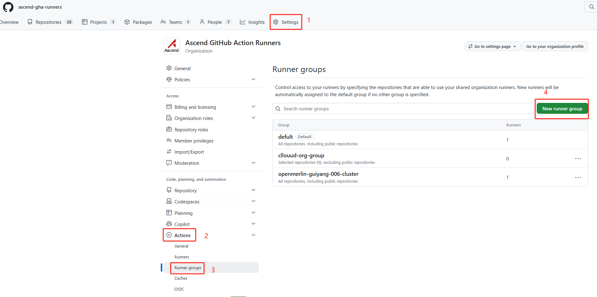
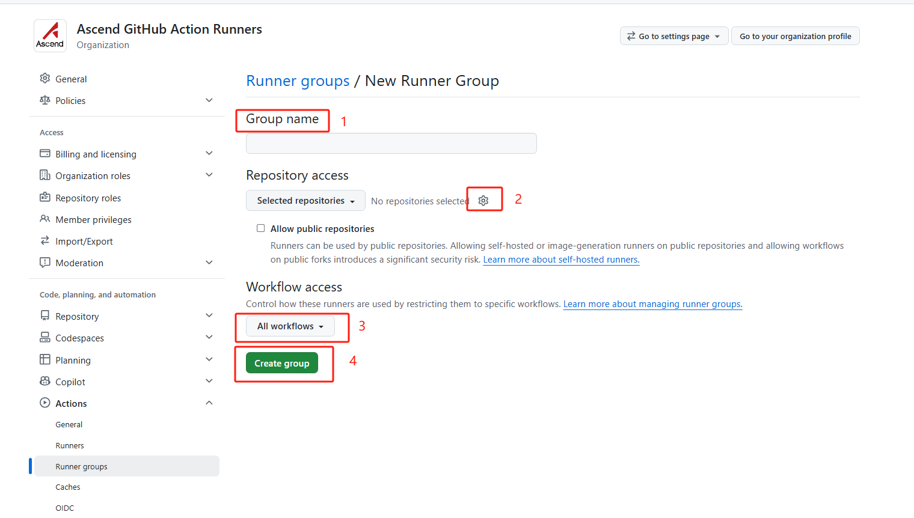

# 安装指南

本文档介绍将 GitHub 组织接入昇腾 NPU CI runner 的 HA 模式两个必要步骤：

1. [安装 GitHub App](#步骤一安装-github-app)
2. [创建 Runner Group](#步骤二创建-runner-group)

---

## 步骤一：安装 GitHub App

### 准备工作

需要具备 **GitHub 组织管理员** 权限。

### 操作步骤

1. 在浏览器中打开 [apps/ascend-runner-mgmt](https://github.com/apps/ascend-runner-mgmt)，点击 **Install**。
2. 选择需要接入的 **GitHub 组织**。
3. 选择仓库授权范围：
   - **Only select repositories**：仅授权指定仓库（选中vllm-ascend和vllm-omni）
4. 确认所需权限后点击 **Install** 完成安装。

---

## 步骤二：创建 Runner Group

Runner Group 用于控制组织内哪些仓库和 workflow 可以使用自托管 runner。需要创建**两个 Runner Group**，分别对应不同的仓库访问范围。

### 进入 Runner Group 页面

在 GitHub 组织页面依次点击 **Settings**（①）→ **Actions**（②）→ **Runner groups**（③），然后点击 **New runner group**（④）。

---

### Runner Group ：指定仓库

此 Group 仅允许指定的仓库使用 runner。

1. **Group name**（①）：填写名称，本次需要创建两个group_name, 分别是guiyang-cluster 和 cn12-cluster。
2. **Repository access**（②）：选择 **Selected repositories**，点击齿轮图标选择目标仓库，选中vllm-ascend和vllm-omni。
3. **Workflow access**（③）：保持默认的 **All workflows**。
4. 点击 **Create group**（④）完成创建。

