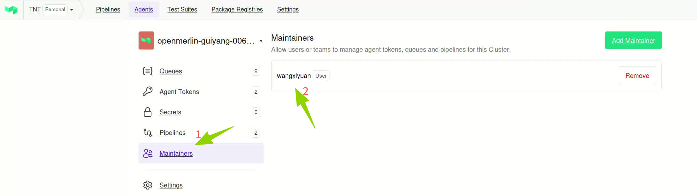
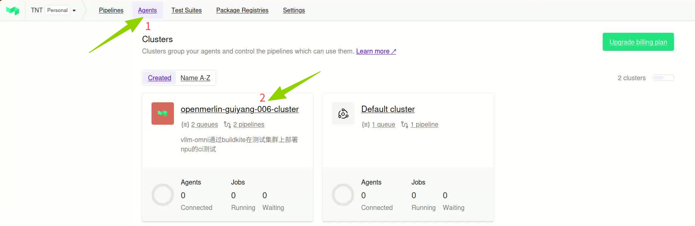
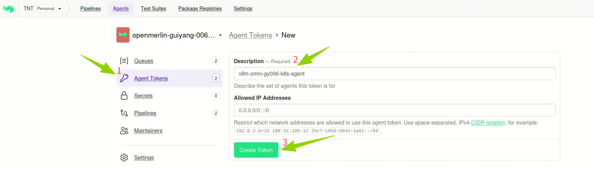
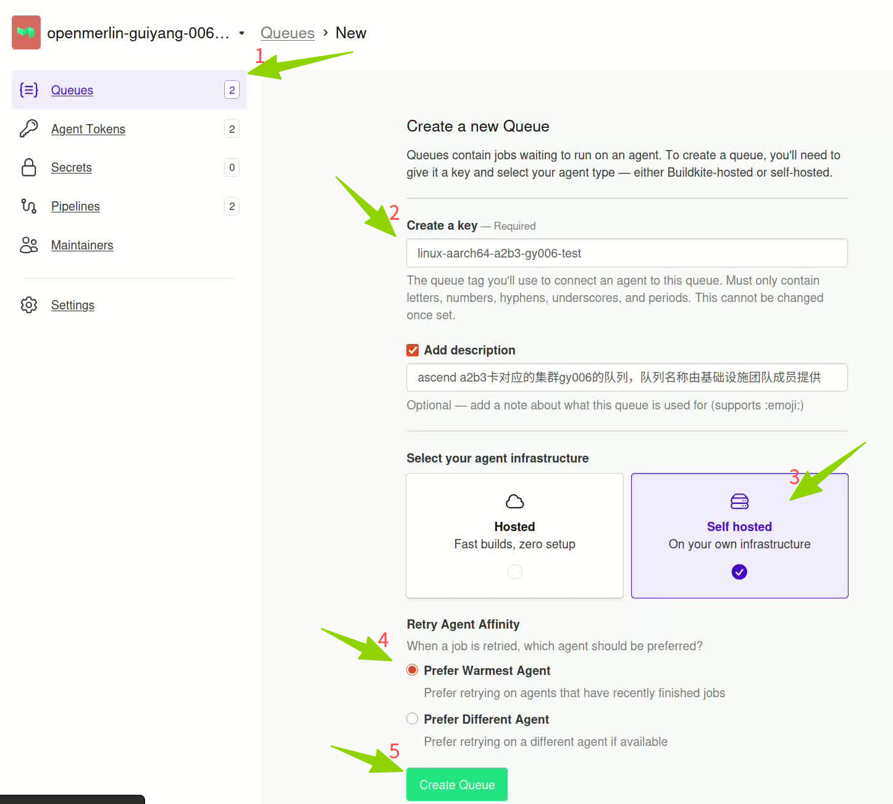
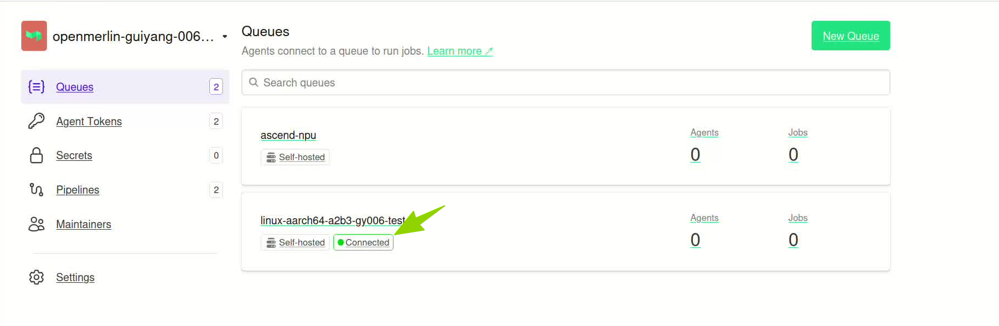
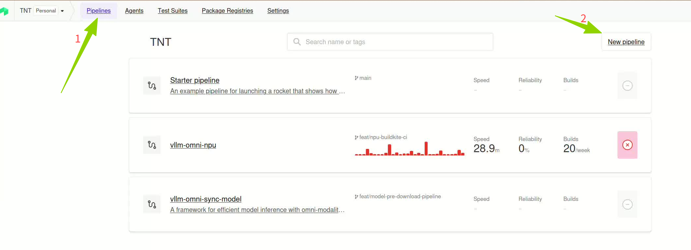
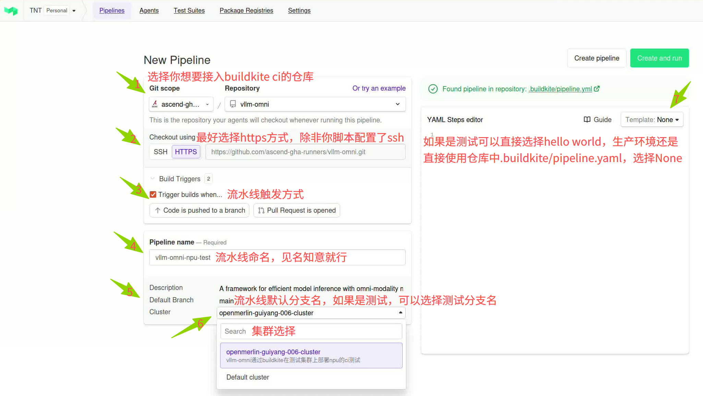
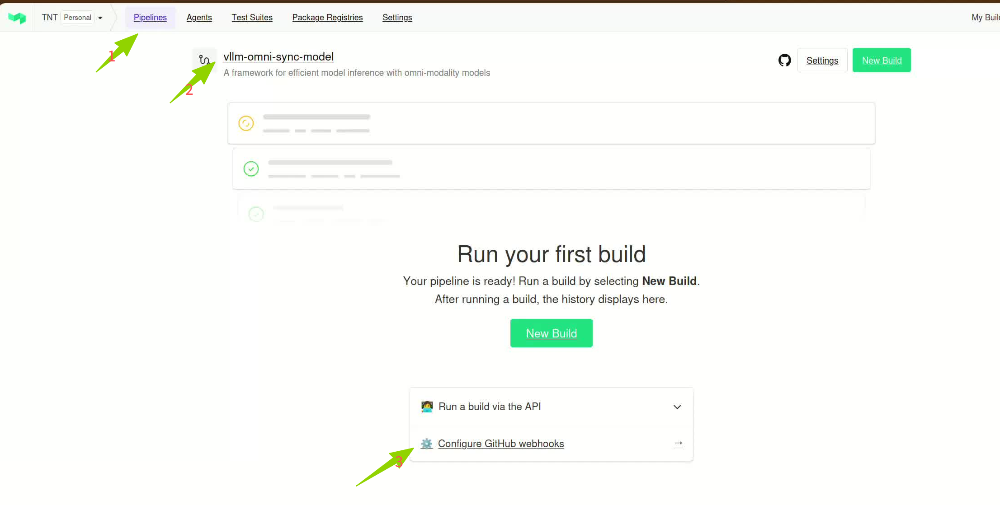
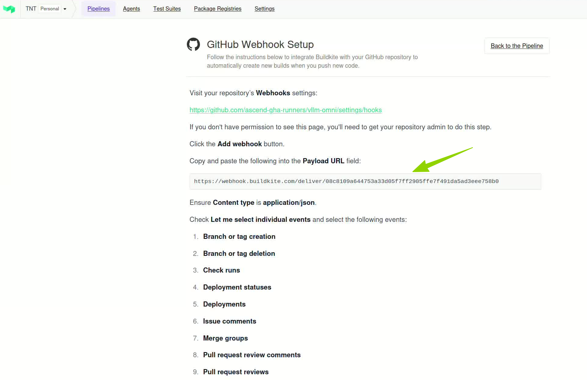
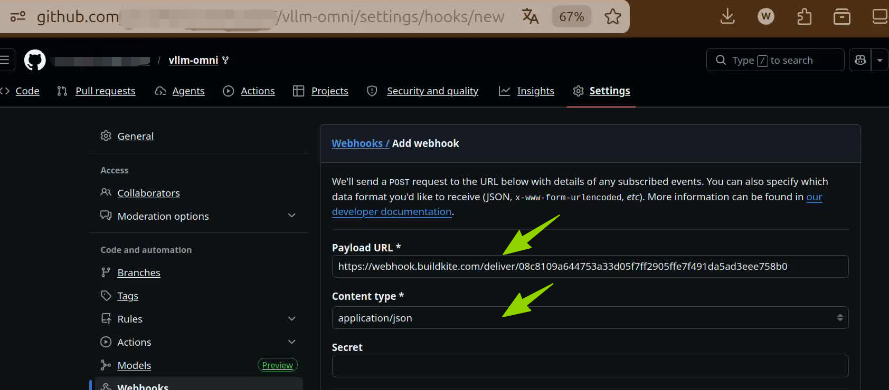

# Buildkite CI Integration Guide

> This document is for open-source community administrators, guiding you through integrating your project with the Buildkite CI system to run CI tasks on Ascend NPU compute resources.

## Architecture Overview

```
┌────────────────────────────────────────────────────────────────────────────────┐
│                        Your Project Repository (GitHub)                        │
│ https://github.com/<org>/<repo>                                                │
│ .buildkite/pipeline.yaml                                                       │
└────────────────────────┬───────────────────────────────────────────────────────┘
                         │ Webhook Trigger
                         ▼
┌────────────────────────────────────────────────────────────────────────────────┐
│                        Buildkite Cloud (buildkite.com)                         │
│   ┌─────────────┐    ┌─────────────┐    ┌─────────────┐    ┌─────────────┐     │
│   │  Pipeline   │───▶│   Queue     │───▶│   Agent     │───▶│    Job      │     │
│   │ Define Flow │    │ Task Queue  │    │  Executor   │    │  Run Task   │     │
│   └─────────────┘    └─────────────┘    └──────┬──────┘    └─────────────┘     │
└────────────────────────────────────────────────┼───────────────────────────────┘
                                                 │ Token Registration
                                                 ▼
┌────────────────────────────────────────────────────────────────────────────────┐
│                       Infrastructure Kubernetes Clusters                       │
│   ┌─────────────────────┐              ┌─────────────────────┐                 │
│   │  CN12-001 Cluster   │              │   HK-001 Cluster    │                 │
│   │   Ascend 910A3      │              │   Ascend 910A2B3    │                 │
│   │  queue: ascend-a3   │              │  queue: ascend-a2b3 │                 │
│   └─────────────────────┘              └─────────────────────┘                 │
└────────────────────────────────────────────────────────────────────────────────┘
```

## Onboarding Flowchart

```
                       Start
                         │
                         ▼
┌───────────────────────────────────────────────────────────────────┐
│ Step 1: Generate Buildkite Agent Token                            │
│ You: Create Token on Buildkite website                            │
│ We: Provide Token receiving channel                               │
│ Acceptance: Token securely delivered to infrastructure team       │
└────────────────────────┬──────────────────────────────────────────┘
                         │
                         ▼
┌───────────────────────────────────────────────────────────────────┐
│ Step 2: Create Queue                                              │
│ You: Inform organization creator to create queue                  │
│ We: Provide queue naming conventions, deploy Agent on cluster     │
│ Acceptance: Queue shows green Connected on Buildkite website      │
└────────────────────────┬──────────────────────────────────────────┘
                         │
                         ▼
┌───────────────────────────────────────────────────────────────────┐
│ Step 3: Create Pipeline on Buildkite Website                      │
│ You: Create Pipeline on Buildkite, link to GitHub repository      │
│ We: Provide Pipeline creation guidance                            │
│ Acceptance: Pipeline created, linked to the correct repository    │
│      Set name, default branch, pipeline script file path, etc.    │
└────────────────────────┬──────────────────────────────────────────┘
                         │
                         ▼
┌───────────────────────────────────────────────────────────────────┐
│ Step 4: Configure Webhook                                         │
│ You: Get Webhook URL from Buildkite website                       │
│ We: Provide Webhook configuration guidance                        │
│ Acceptance: Pushing code to repo triggers Pipeline                │
│      Configure Webhook in GitHub repository Settings              │
└────────────────────────┬──────────────────────────────────────────┘
                         │
                         ▼
┌───────────────────────────────────────────────────────────────────┐
│ Step 5: Write Pipeline YAML                                       │
│ You: Write .buildkite/pipeline.yaml using template                │
│ We: Provide template and field descriptions                       │
│ Acceptance: Pipeline syntax correct, parses correctly on website  │
└────────────────────────┬──────────────────────────────────────────┘
                         │
                         ▼
┌───────────────────────────────────────────────────────────────────┐
│ Step 6: Validate Integration                                      │
│ You: Submit code, observe Pipeline run status                     │
│ We: Assist with troubleshooting                                   │
│ Acceptance: Job successfully executes on Ascend NPU               │
└────────────────────────┬──────────────────────────────────────────┘
                         │
                         ▼
               Integration Complete
```

## Detailed Steps

### Step 1: Generate Buildkite Agent Token

**Goal**: Create a Token so that the infrastructure team's Agent can connect to your Buildkite organization.

What you need to do:

1. **Verify your permissions**: You must be an **Admin** or **Organization Creator** of the Buildkite organization.
   - If you are not an admin, contact your project's Buildkite organization creator.
   - To check: Log in to [buildkite.com](https://buildkite.com), navigate to your organization, click **Settings** → **Members**, and see who has the Admin role.

2. **Generate Agent Token**:
   - Log in to [buildkite.com](https://buildkite.com)
   - Navigate to your organization → **Agents** → **Agent tokens**
   - Click **New Agent Token**
   - Fill in the description with naming format: `<project_name>_<cluster_name>`
     - Example: `vllm_omni_cn12_001`, `vllm_omni_hk001`
   - Click **Create Token**
   - **Copy and save the Token immediately** (it is only displayed once and cannot be viewed again after closing)
  
  
  

How to send the Token to us:

- Send the Token to an infrastructure team member through a secure channel (e.g., encrypted messaging, private ticket).
- **Do not** share the Token through public channels, plain-text emails, or code repositories.

How to verify this step is complete:

- You have securely delivered the Token to the infrastructure team.
- The infrastructure team confirms receipt of the Token.

---

### Step 2: Create Queue

**Goal**: Create a queue to route CI tasks to the Ascend NPU cluster for execution.

Queue naming conventions:

| Cluster | NPU Model | Queue Name |
|---------|-----------|------------|
| CN12-001 | Ascend 910A3 | `ascend-a3` |
| HK-001 | Ascend 910A2B3 | `ascend-a2b3` |

> If your project needs to use both clusters simultaneously, you need to create two Tokens and two queues.

What you need to do:

1. Contact your Buildkite organization creator (admin) to create a queue on the Buildkite website:
   - Navigate to organization → **Queues** → **Create Queue**
   - The queue name must use the standard names from the table above (e.g., `ascend-a3`)

2. Inform the infrastructure team with the following details:
   - Project name
   - Git repository URL
   - Target cluster (CN12-001 or HK-001)
   - Corresponding queue name
   - The Token generated in Step 1

What we do:

- The infrastructure team will deploy the Buildkite Agent on the corresponding Kubernetes cluster after receiving the information.
- The Agent will register with Buildkite using your Token and listen for tasks on the specified queue.

How to verify this step is complete:

- Log in to [buildkite.com](https://buildkite.com) → navigate to your organization → **Agents**
- Find the corresponding Queue (e.g., `ascend-a3`)
- Check Agent status: **Connected column shows a green dot** ✅ indicating successful connection
- If it shows gray or red, the Agent is not connected. Contact the infrastructure team for troubleshooting


Queue: ascend-a3

| Agent Name | Version | Queue | Connected |
|------------|---------|-------|-----------|
| agent-abc123 | v3.80.0 | ascend-a3 | 🟢 ← Green = connected |


---

### Step 3: Create Pipeline on Buildkite Website

**Goal**: Create a Pipeline on the Buildkite website, link it to your GitHub repository, and configure basic settings.

What you need to do:

1. **Create Pipeline**:
   - Log in to [buildkite.com](https://buildkite.com)
   - Navigate to your organization → **Pipelines** → **New Pipeline**
   - Fill in the following configuration:

2. **Pipeline basic configuration**:
   - **Name**: Give your Pipeline a suitable name (e.g., project name + purpose, such as `vllm-npu-ci`)
   - **Repository**: Select or enter your GitHub repository URL (e.g., `https://github.com/<org>/<repo>`)
   - **Default Branch**: Set the default trigger branch (e.g., `main`)
   - **Pipeline Definition Source**: Choose to read Pipeline definition from repository
     - Select **Read pipeline definition from repository**
     - **File path**: Enter the Pipeline script file path, default is `.buildkite/pipeline.yml`

3. **Trigger conditions configuration** (optional):
   - After creating the Pipeline, go to **Settings** → **GitHub**
   - Configure trigger conditions:
     - **Trigger builds on pushes**: Trigger on push
     - **Trigger builds on pull requests**: Trigger on PR
   - You can choose to trigger only on specific branches or when specific files change




How to verify this step is complete:

- You can see the newly created Pipeline in the Pipelines list on the Buildkite website
- The Pipeline's **Repository** shows your GitHub repository URL
- The Pipeline's **Source** shows it reads from repository (`.buildkite/pipeline.yml`)

---

### Step 4: Configure Webhook

**Goal**: Enable GitHub repository events (pushes, PRs, etc.) to automatically trigger Buildkite Pipeline.


What you need to do:

1. **Get Webhook URL**:
   - Log in to [buildkite.com](https://buildkite.com)
   - Navigate to your organization → find the Pipeline created in Step 3
   - Go to Pipeline → **Settings** → **GitHub**
   - Find the **Webhook URL** and copy it
   - Format: `https://webhook.buildkite.com/deliver/xxxxxx`

2. **Configure Webhook in GitHub repository**:
   - Open your GitHub repository → **Settings** → **Webhooks** → **Add webhook**
   - **Payload URL**: Paste the Webhook URL from the previous step
   - **Content type**: Select `application/json`
   - **Secret**: Fill in as required by your team; leaving blank is not recommended for production environments
   - **Events**: Select **Let me select individual events**, then check:
     - `Pushes`
     - `Pull requests`
   - Click **Add webhook**




How to verify this step is complete:

- On the GitHub Webhooks page, the newly added Webhook shows a green dot ✅
- Or push a test commit to the repository and check whether a new Build appears on the Buildkite website

---

### Step 5: Write Pipeline YAML

**Goal**: Define your CI task flow, telling Buildkite what tasks to execute and on what resources.

What you need to do:

1. Create a `.buildkite/` directory in your project repository root
2. Create `pipeline.yaml` (or `pipeline.yml`) in that directory
3. Write your Pipeline following the template below

Pipeline template:

Below is a complete example showing a typical flow of building an image and running tests on Ascend NPU:

```yaml
steps:
  # Step 1: Build and push image
  - label: ":buildkit: Build and Push NPU Test Image"
    key: image-build
    agents:
      queue: "ascend-a2b3"
      resource_class: "npu-2"
    plugins:
      - kubernetes:
          metadata:
            annotations:
              vault.hashicorp.com/agent-init-first: "true"
              vault.hashicorp.com/agent-inject: "true"
              vault.hashicorp.com/role: ascend-gha-runners
              vault.hashicorp.com/tls-skip-verify: "true"
    env:
      VLLM_IMAGE_TAG: "${BUILDKITE_COMMIT}"
      IMAGE_NAME: "your-project-ci-npu"
      IMAGE_REGISTRY: "swr.cn-southwest-2.myhuaweicloud.com/your-namespace"
      BUILDKITD_ADDR: "tcp://buildkitd-service.buildkitd:1234"
    command: |
      set -ex
      echo "--- Building and pushing NPU Test Image"
      echo "Image: ${IMAGE_REGISTRY}/${IMAGE_NAME}:${VLLM_IMAGE_TAG}"
      # Your image build commands...

  # Step 2: Run tests on NPU (depends on image build completion)
  - label: "🧪 NPU Unit Test"
    depends_on: image-build
    key: npu-test
    agents:
      queue: "ascend-a3"
      resource_class: "npu-2"
    image: "${IMAGE_REGISTRY}/${IMAGE_NAME}:${BUILDKITE_COMMIT}"
    command: |
      set -ex
      echo "--- Running NPU tests"
      pytest -v -s -m 'npu'
```

Key field descriptions:

| Field | Meaning | Example | Description |
|-------|---------|---------|-------------|
| `label` | Task display name | `🧪 NPU Unit Test` | Task name shown on Buildkite website, supports emoji |
| `key` | Unique task identifier | `npu-test` | Used for dependency references between tasks, must be unique within a Pipeline |
| `depends_on` | Dependency on prior task | `image-build` | Specifies which task must complete before this one runs |
| `agents.queue` | **Queue name** | `ascend-a3` | **Required**, specifies which queue to execute the task on, must match the queue name created in Step 2 |
| `agents.resource_class` | **NPU resource spec** | `npu-2` | **Required**, specifies how many NPU cards are needed |
| `image` | Runtime image | `registry/your-image:tag` | Container image used for task execution |
| `command` | Execute command | `pytest -v` | Actual shell command to execute |
| `env` | Environment variables | `KEY: value` | Environment variables passed to the task |
| `if` | Trigger condition | `build.branch == "main"` | Only execute this task when condition is met |
| `plugins.kubernetes` | K8s plugin config | See template | Used for injecting Vault secrets and other advanced configurations (usually provided by infrastructure team) |

Resource class (resource_class) selection:

| Resource Class | NPU Cards | CPU | Memory | Use Case |
|----------------|-----------|-----|--------|----------|
| `npu-1` | 1 card | 23 cores | 64Gi | Lightweight testing |
| `npu-2` | 2 cards | 39-46 cores | 128Gi | Standard testing (recommended default) |
| `npu-4` | 4 cards | 78 cores | 256Gi | Medium-scale testing |
| `npu-8` | 8 cards | 156 cores | 512Gi | Large-scale testing |
| `npu-16` | 16 cards | 312 cores | 1024Gi | Stress testing / full testing |

> Note: `npu-1` and `npu-16` are only available on specific clusters. Consult the infrastructure team for details.

How to verify this step is complete:

- Commit `pipeline.yaml` to your repository
- On the Buildkite website, navigate to the corresponding Pipeline and verify it parses correctly and displays the Pipeline structure
- No syntax errors are shown

---

### Step 6: Validate Integration

<!-- TODO: Add image:  -->

Complete validation flow:

1. **Confirm Agent is connected**
   - Log in to [buildkite.com](https://buildkite.com) → your organization → **Agents**
   - Confirm the Agent under the corresponding Queue shows **green Connected** ✅

2. **Trigger a test run**
   - Push a code change to your repository (or create a PR)
   - Wait a few seconds and check if a new Build appears on the Buildkite website

3. **Observe Pipeline execution**
   - Navigate to the Build → view Pipeline execution flow
   - Confirm the status of each Step:
     - 🟢 Green: Success
     - 🔴 Red: Failed
     - 🟡 Yellow: Running
     - ⚪ Gray: Waiting

4. **Confirm task executed on Ascend NPU**
   - Click any Step to view detailed logs
   - Logs should show NPU-related output (e.g., results from `npu-smi info`)

Validation checklist:

- [ ] Agent Token has been generated and securely delivered to the infrastructure team
- [ ] Queue has been created with a standard name (`ascend-a3` or `ascend-a2b3`)
- [ ] Agent for the corresponding Queue on Buildkite website shows green Connected
- [ ] Pipeline has been created on Buildkite website and linked to the correct GitHub repository
- [ ] Webhook has been configured in the GitHub repository and is functioning properly
- [ ] `.buildkite/pipeline.yml` has been committed to the repository
- [ ] After pushing code, Buildkite automatically triggered a Build
- [ ] Job in the Build successfully executed on Ascend NPU

---

## FAQ

**Q1: How do I find out who my organization creator is?**

Log in to [buildkite.com](https://buildkite.com) → navigate to your organization → **Settings** → **Members**, and look for users with the **Admin** role.

**Q2: What if the Agent connection status is not green?**

- Check whether the Token was correctly delivered to the infrastructure team
- Confirm the Queue name matches the queue that the infrastructure team's deployed Agent is listening on
- Contact the infrastructure team to troubleshoot Agent deployment status

**Q3: No Build was triggered after pushing code?**

- Check whether the GitHub Webhook configuration is correct and if there are recent successful delivery records in the Webhook list
- Confirm the `.buildkite/pipeline.yaml` file path and format are correct
- Check whether the Pipeline's Source Code settings point to the correct repository and branch

**Q4: How to view task execution logs?**

On the Buildkite website → navigate to a specific Build → click any Step → the right panel shows real-time log output.

**Q5: What if my project needs to use multiple clusters simultaneously?**

- Generate independent Agent Tokens for each cluster (e.g., `project_cn12_001`, `project_hk001`)
- Route tasks to different clusters using different `queue` fields in the Pipeline:
  ```yaml
  - label: "Test on A3"
    agents:
      queue: "ascend-a3"
      resource_class: "npu-2"
    command: ...

  - label: "Test on A2B3"
    agents:
      queue: "ascend-a2b3"
      resource_class: "npu-2"
    command: ...
  ```

---

## Feedback & Support

If you encounter any issues during integration, please report them through:

- **Submit an Issue**: [https://github.com/opensourceways/backlog](https://github.com/opensourceways/backlog)
- When submitting an Issue, please provide:
  - Project name and Git repository URL
  - Issue description and error log screenshots
  - Completed steps and where you are stuck

---

*Document version: v2.0*  
*Last updated: 2026-04-28*