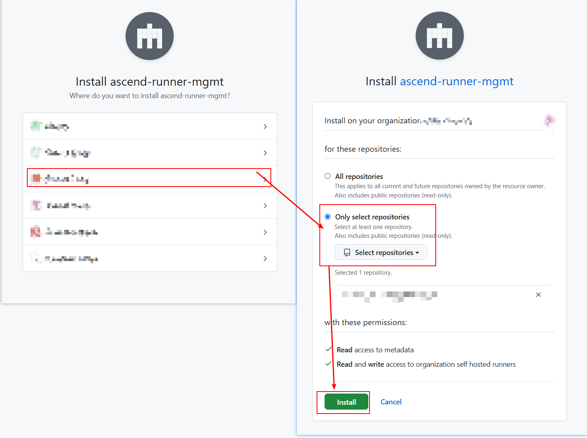
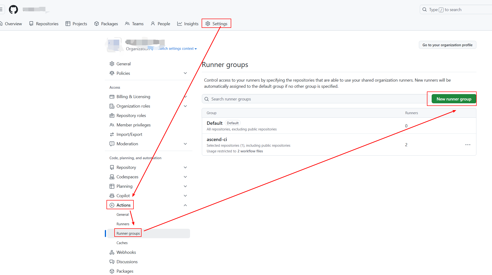
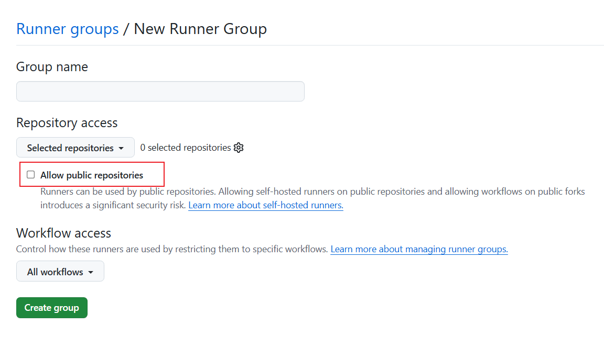
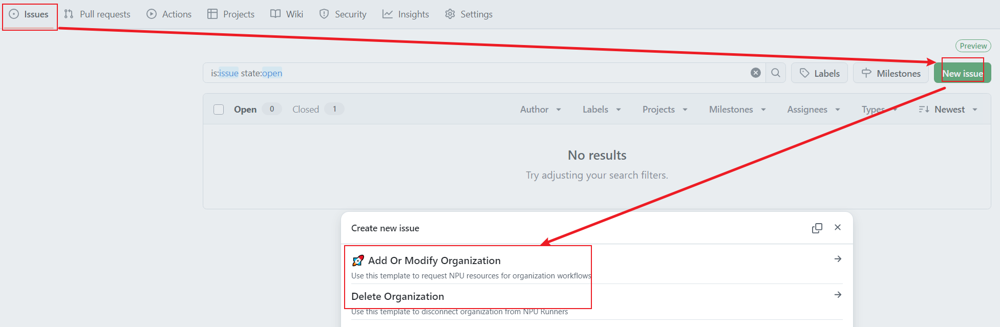
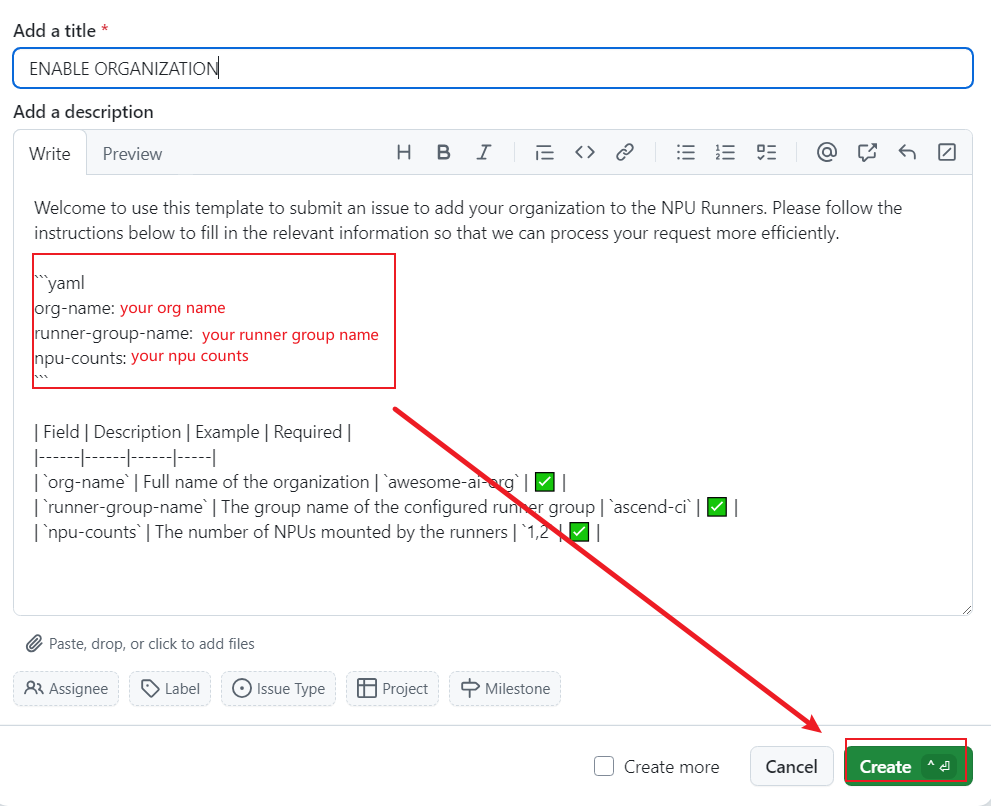
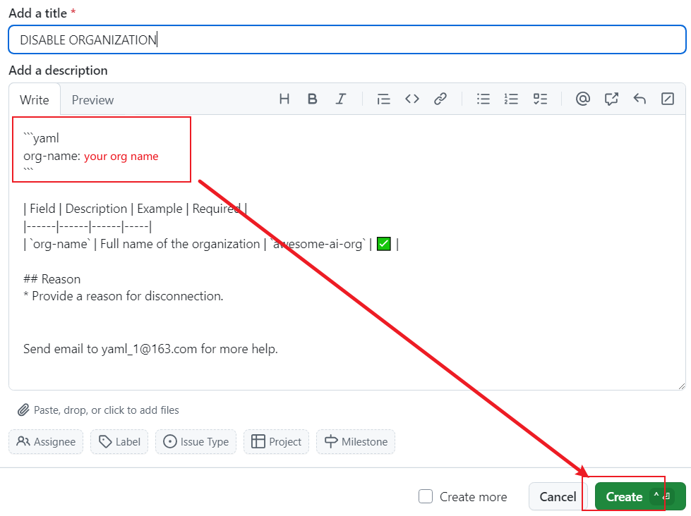
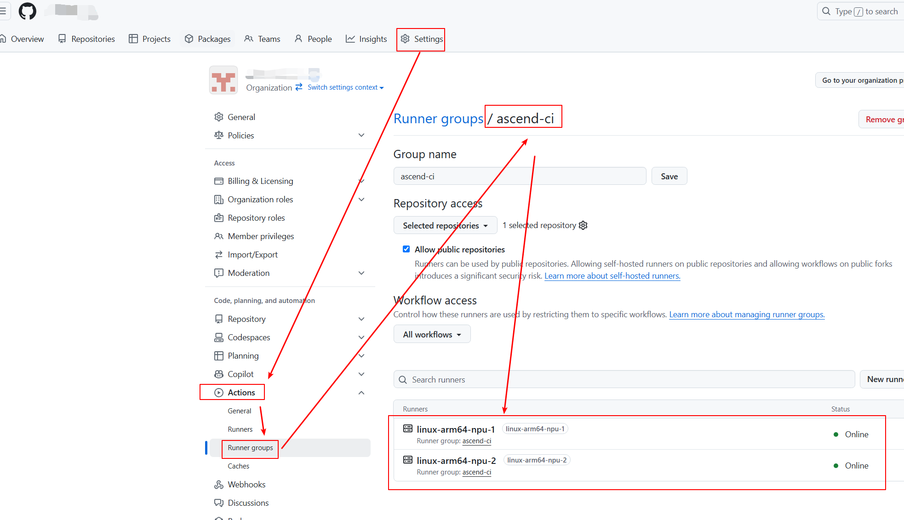

# User Manual
## Organization Administrator → How to Integrate Ascend Devices into GitHub Actions for an Organization/Repository
### Prerequisites
Require administrative permissions for the organization.

### 1 Install GitHub App
Visit [apps/ascend-runner-mgmt][1] in your browser and click `Install`.

Select the organization and repositories, then click `Install`.


### 2 Submit a Request

#### 2.1 Configure Runner Group
Go to the `Settings` of organization → `Actions` → `Runner groups` → `New runner group`.


Configure repositories and workflows in the creation page. Note the `Group name`, you will use it later.
To allow public repositories to access ·NPU Runners·, enable `Allow public repositories`.


#### 2.3 Submit the Request
Visit `https://github.com/ascend-gha-runners/org-archive/issues` and click `New issue` to select a template.

- `Add Or Modify Organization`: Create or update organization configurations.
- `Delete Organization`: Remove an organization.


##### 2.3.1 Add Or Modify Organizaiton
Fill in the parameters and click `Create`.
`org-name`：Full name of the organization.
`runner-group-name`: The name of runner group。
`npu-counts`: The number of NPUs mounted by the runners。

##### 2.3.2 Delete Organization
Fill in the parameters and click `Create`.
`org-name`：Full name of the organization.


## Workflow User → How to Use Ascend Devices in GitHub Actions
### 1 NPU Runners names
NPU Runners names consist of the following components:
```
linux-amd64-npu-x
^     ^     ^   ^
|     |     |   |
|     |     |   Number of NPUs Available
|     |     NPU Designator
|     Architecture
Operating System
```

### 2 Check NPU Runners Availability
#### 2.1 View via Configuration File
We maintain the latest configuration of all organizations connected to NPU Runners in the `https://github.com/ascend-gha-runners/org-archive/tree/main/org-archive/` directory. View your organization’s configuration in `<your-org>.yaml`, where the `online-runners` field displays the available NPU Runners.

#### 2.2 View via Runner Groups
Navigate to the `Settings` of organization → `Actions` → `Runner groups`. Configured NPU Runners (e.g., `linux-arm64-npu-1`, `linux-arm64-npu-2`) will be visible under your runner group.


### 3 Use NPU Runners in Workflows
NPU jobs must run in a container (e.g., `ascendai/cann:latest`). If no container is specified, the job will not utilize NPU resources.
The following example shows how a GitHub Action workflow uses NPU Runners.
```yaml
name: Test NPU Runner
on:
  workflow_dispatch:
jobs:
  job_0:
    runs-on: linux-arm64-npu-1
    container:
      image: ascendai/cann:latest
      
    steps:
      - name: Show NPU info
        run: |
          npu-smi info
```

If you have any questions, please [file a discussion](https://github.com/ascend-gha-runners/docs/discussions) or contact via gouzhonglin@huawei.com.


[1]: https://github.com/apps/ascend-runner-mgmt